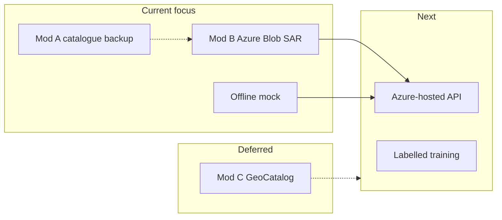

# SAR Geoprocessing & Automated Core Platform

A modular, microservice-ready geospatial platform designed for advanced Synthetic Aperture Radar (SAR) imagery preprocessing and distributed deep learning orchestration. This public repository showcases the core foundational pipeline for civilian remote sensing applications, such as environmental change detection, natural disaster monitoring, and smart urban planning.

## Before / After — Multi-Sensor Geospatial Display

Coastal zone analysis at the same operational scale (512 px grid). The comparison illustrates the evolution from a baseline fused frame to an enhanced fusion product with improved contrast, radar overlay compositing, and structured target metadata.

<table>
  <tr>
    <td align="center" width="50%">
      <strong>Before</strong><br />
      <sub>Baseline fused optical + radar frame</sub><br /><br />
      
    </td>
    <td align="center" width="50%">
      <strong>After</strong><br />
      <sub>Enhanced fusion, overlay, and HUD export</sub><br /><br />
      
    </td>
  </tr>
</table>

> **Note:** This repository contains the **foundational, open-source-safe** components of the platform. Operational data-ingestion services, tactical visualization layers, and production API integrations are maintained in a separate private development environment and are summarized here at a high level only.

---

## New Updates

The following section reflects the **latest engineering cycle** on the private development branch (2025–2026). It documents architecture decisions, cloud integration attempts, and operational fallbacks at a high level—without exposing credentials, connection strings, or deployment-specific secrets.

### Modular Runtime Modes (A / B / C)

The extended platform now selects its data plane through a **single configuration switch** (environment-driven), rather than hard-coded providers:

| Mode | Designation | Data plane (summary) |
|------|-------------|----------------------|
| **A** | Fast / catalogue | Live optical basemap + Sentinel-1 SAR via public STAC catalogue (Planetary Computer pattern) |
| **B** | Enterprise / storage | Sentinel-1 VV/VH COG read from **Azure Blob Storage** with coordinate-windowed partial reads (primary production path) |
| **C** | GeoCatalog | Azure **Planetary Computer Pro GeoCatalog** STAC integration (reserved for when the service is stable) |

**Inference and visualization remain decoupled:** radar tensors feed the multi-task CNN; fused optical + SAR layers feed high-DPI tactical exports.

### Azure Blob Storage Integration (Mod B)

A dedicated **blob storage layer** was introduced for enterprise deployments:

- Container-oriented layout for **SAR COG assets**, optional optical GeoTIFFs, and **tactical PNG outputs**
- **Windowed COG/GeoTIFF reads** (512×512 geographic windows) to minimize bandwidth versus full-scene downloads
- Signed upload of generated tactical maps to an **output container**, with blob URLs returned in API responses (`tactical_map_blob_url`)
- Centralized configuration via **typed settings** (Pydantic Settings pattern) for containers, blob paths, timeouts, and run mode

### Azure GeoCatalog Pro — Attempted, Not Adopted (Yet)

**Microsoft Planetary Computer Pro GeoCatalog** (West Europe deployment) was evaluated as the unified STAC + Entra ID data plane for both optical and SAR streams.

**Outcome:** Integration was **not successful in production testing**—the GeoCatalog resource remained **blocked by platform instability** (deployment and endpoint availability issues on the Azure side during the evaluation window). The codebase retains a **Mod C hook** for future re-enablement, but the **active roadmap does not depend on GeoCatalog** until the service is reliable.

**Current production direction:** Mod B (Azure Blob Storage) as the primary SAR source, with Mod A (public catalogue) and **offline mock** as fallbacks.

### Offline / Zero-Network Operation

To support development without consuming internet bandwidth, an **offline-only mode** was added:

- Local **`mock_s1.tif`** (2-band Sentinel-1–style VV/VH GeoTIFF) drives SAR I/Q generation
- Synthetic optical RGB derived from the same mock asset (no third-party tile servers)
- No blob upload, no catalogue calls, no Esri tiling when this mode is enabled
- Suitable for CI smoke tests, air-gapped demos, and model/UI validation

### Configuration & API Hardening

- **Pydantic Settings**–based `.env` schema: run mode, storage containers, blob paths, offline flags, catalogue keys (private only)
- FastAPI response models extended with **fusion provenance** (scene id, processing level, source label) and optional **blob URL** for tactical exports
- **Fail-fast** behaviour preserved: no silent synthetic map substitutes on production ingestion paths

### What Changed vs. Earlier Public Summary

| Earlier | Now |
|---------|-----|
| Single catalogue path | **Three explicit modes** (catalogue / blob / GeoCatalog) |
| GeoCatalog listed as “in progress” | **Attempted; deferred** due to Azure-side issues |
| Internet required for demos | **Offline mock path** available |
| Local PNG only | Optional **cloud-staged tactical outputs** (Mod B) |

---

## Architectural Overview & Core Pipeline

The platform establishes a seamless, production-grade engineering pipeline that processes raw radar telemetry maps and prepares them for neural network feature extraction.

### 1. Telemetry Ingestion & Simulation Module (`sar_processor.py`)
- Simulates or ingests high-resolution radar matrices (GeoTIFF / Sentinel-1 format compatibility).
- Handles foundational radiometric calibration pipelines.

### 2. Despeckling Engine (Signal Processing)
- Implements a programmatic Lee Filter utilizing local variance and spatial mean convolutions to eliminate multiplicative speckle noise (salt-and-pepper artifacts inherent to radar signals).
- Performs Logarithmic Decibel ($10 \cdot \log_{10}$) scaling to optimize pixel distribution for neural network convergence.

### 3. Multi-Task Deep Learning Backbone (`atr_detector.py`)
- Features a customized Convolutional Neural Network (CNN) backbone leveraging Instance Normalization and Leaky ReLU activations for complex feature preservation.
- Utilizes a parallel multi-head architecture consisting of:
  - **Classification Head**: Computes spatial grid probability maps across civilian targets.
  - **Regression Head**: Predicts bounding box coordinates relative to localized grid frameworks.

### 4. Multi-Task Optimization Layer (`multi_task_loss.py`)
- Implements a hybrid loss function bridging:
  - **Cross-Entropy Loss** for semantic categorization.
  - **Mean Squared Error (MSE) Loss** for bounding box regression.
- Features an advanced object masking technique that mathematically isolates coordinate regression penalties strictly to grid coordinates containing verified targets.

---

## Platform Evolution & Recent Capabilities

The following items describe engineering milestones achieved on the extended platform branch. They are documented here for transparency without exposing proprietary endpoints, credentials, or deployment-specific configuration.

### Geospatial Data Ingestion (Coordinate-Driven)
- Replaced brittle, path-dependent remote file access patterns with **latitude/longitude–centric window extraction**.
- Introduced live **optical basemap tiling** for high-resolution contextual imagery aligned to a fixed analysis grid (e.g., 512×512).
- Eliminated placeholder synthetic map fallbacks in favor of **fail-fast, auditable ingestion** when upstream sources are unavailable.

### Multi-Sensor Data Fusion Architecture
- Designed a **dual-stream fusion model** that registers optical RGB and SAR-derived channels on a **shared geographic reference frame**.
- SAR channels are supplied as a **two-band I/Q–style tensor** compatible with the existing complex-valued CNN front-end.
- Separation of concerns:
  - **Inference stream** → radar tensor for detection heads.
  - **Visualization stream** → fused optical + radar products for human review.

### SAR Signal Path (Research → Operational)
- Early prototypes used **optically derived SAR proxies** for rapid UI and model integration testing.
- Current direction integrates **real public SAR products** (e.g., Sentinel-1 family) via **cloud-optimized GeoTIFF / STAC catalogue** access patterns, with optional local GeoTIFF overrides for offline or air-gapped workflows.
- Metadata discovery aligns with standard **civilian Earth observation catalogues**; authentication is handled through environment-level credentials (not committed to this repository).

### Geospatial Image Enhancement (Visualization Pipeline)
- **Histogram stretching** (percentile-based contrast normalization) for clearer land–water–structure separation.
- **Unsharp masking** for edge-preserving crispness on optical basemaps.
- **Speckle suppression** on radar amplitude layers (box/local filtering) prior to overlay compositing.
- Semi-transparent **radar heatmap overlay** on optical imagery for intuitive multi-sensor interpretation.

### Tactical Situation Display (Export Quality)
- High-DPI raster export suitable for briefing materials and after-action review.
- Monospace HUD-style annotations: target lock, coordinates, fusion status, and signal-strength readouts.
- Configurable grid and contrast settings to preserve fine structure (harbors, vessels, coastal infrastructure) under overlay graphics.

### Service-Oriented Analytics Layer (Private Branch)
- REST endpoint pattern for **on-demand target-detection / zone analysis** from geographic coordinates.
- Startup-time model weight hydration from checkpoint storage.
- Structured JSON responses including tensor shape metadata and fusion provenance fields.

### Training Pipeline Alignment
- Dataset loaders updated to consume **real SAR windows** where catalogue access is configured.
- Training scripts decoupled from invalid granule archive URLs in favor of catalogue-driven COG reads.
- ASF-style scene search retained for **metadata and mission planning**, not as a substitute for pixel-accurate COG streaming.

---

## What Is Intentionally Not in This Repository

To protect ongoing research and operational security, the public tree **does not** include:

| Category | Reason |
|----------|--------|
| API server implementation & routes | Production deployment surface |
| Live tile server URLs & API keys | Credential hygiene |
| Catalogue subscription / Earthdata / Azure connection strings | User-specific secrets |
| Offline mock assets (`mock_s1.tif`) | Local-only dev artefacts |
| Mod A/B/C wiring & blob store implementation | Private deployment code |
| Tactical visualizer source & styling constants | Operational UI/IP |
| Trained model checkpoints | Size, sensitivity, reproducibility |
| Domain-specific targeting logic | Application-specific |

Contributors and reviewers should treat this README as a **capability manifest**; implement details live in the private monorepo.

---

## Quick Start & Integration Verification

To run the full end-to-end integration test locally, execute the consolidated pipeline test script. This script verifies the integrity of the signal processing filter, PyTorch tensor formatting, forward-pass mapping, and backpropagation mechanics.

### Prerequisites

Ensure your localized virtual environment (`venv`) has the following enterprise dependencies installed:

```bash
pip install torch torchvision scipy numpy opencv-python rasterio
```

### Execution

Run the verification wrapper from the root of the project directory:

```bash
python src/train_and_test.py
```

> When connecting to external SAR catalogues, additional optional dependencies (STAC client libraries, HTTP tooling) may be required in the private environment. Those are not mandatory for the core integration test in this repository.

---

## Expected Test Vector Output

Upon successful execution, the pipeline initializes the neural weights, filters the simulated radar noise, handles the loss masking matrices, and delivers the following mathematical verification output in the console:

```plaintext
====================================================
      SAR GEOPROCESSING PLATFORM - INTEGRATION TEST
====================================================

[1] Hardware Acceleration: Processing pipeline initialized on [CPU].

[2] Running Signal Processing Pipeline...
--> Generating raw simulated synthetic telemetry matrix...
--> Executing Speckle Noise Elimination (Lee Filter)...
--> Logarithmic dB transformation complete. Output Tensor Shape: (512, 512)

[3] Initializing Deep Learning Core Architecture...
--> Multi-Task Detection Heads successfully configured and cached.
--> Multi-Task Masked Loss Criterion loaded.

[4] Running End-to-End Forward & Backward Pass (1 Iteration Test)...

================ INTEGRATION RESULTS ================
Classification Probability Map Shape : torch.Size([1, 5, 64, 64])
Bounding Box Regression Map Shape   : torch.Size([1, 4, 64, 64])
Computed Total Pipeline Loss (Multi-Task): 4.1535
 -> Class Categorization Penalty         : 1.6536
 -> Bounding Box Alignment Penalty       : 1.2564
=====================================================

[SUCCESS] Core integration pipeline executed with zero exceptions.
```

---

## Technology Stack & Engineering Practices

### Deep Learning Framework
- PyTorch (Core Neural Architectures)

### Signal & Matrix Engineering
- NumPy
- SciPy
- OpenCV
- Rasterio (GeoTIFF / COG window reads — extended branch)

### Geospatial Interoperability (Extended Branch)
- STAC catalogue discovery patterns
- Cloud-Optimized GeoTIFF partial reads
- Dual-sensor (optical + SAR) co-registration

### Architectural Patterns
- Multi-Task Learning
- Decoupled Grid-Based Localization
- Aspect Vector Masking
- Multi-sensor data fusion (optical context + SAR inference)

### Software Engineering Standards
- Test-Driven Infrastructure
- Strict Variable-Type Isolation
- Clean Modular Code Architecture
- Fail-fast ingestion (no silent synthetic substitutes in production paths)

---

## Roadmap (Public Summary)

A **revised multi-phase roadmap** was defined after the GeoCatalog evaluation and Azure Storage proof-of-concept. Phases below supersede earlier “catalogue-only” assumptions.

| Phase | Status | Focus |
|-------|--------|--------|
| **1 — Core ML** | Done | Lee filtering, dB scaling, multi-task CNN, masked loss |
| **2 — Multi-sensor fusion** | Done | Shared-grid optical + SAR tensors, histogram/unsharp pipeline, radar overlay, HUD export (300 DPI) |
| **3 — Mod B (Azure Blob SAR)** | In progress | VV/VH COG on storage, windowed reads, tactical output staging |
| **4 — Mod A (catalogue fallback)** | Supported | Public STAC Sentinel-1 when storage or GeoCatalog unavailable |
| **5 — GeoCatalog (Mod C)** | **Deferred** | Revisit when Azure GeoCatalog Pro is stable; not a current blocker |
| **6 — Offline mock** | Done | Zero-network dev/demo path via local mock GeoTIFF |
| **7 — Azure hosting** | Planned | Containerized API (e.g. App Service / Container Apps), managed identity, Key Vault |
| **8 — ML maturity** | Planned | Real labels, training manifests, reduced reliance on random targets |
| **9 — Optional GIS desktop** | Optional | Analyst VM (e.g. ArcGIS + catalogue connectors)—not on the critical path |



**Strategic takeaway:** Ship on **enterprise storage + private API** first; treat **GeoCatalog as a future upgrade**, not a dependency for the current release train.

---

## License & Attribution

This project processes publicly available Earth observation data when configured to do so. Users are responsible for complying with the terms of any third-party data provider they connect to in their private deployment. No provider credentials or endorsements are implied by this repository.
