# SAR Geoprocessing & Automated Core Platform

A modular, microservice-ready geospatial platform for Synthetic Aperture Radar (SAR) preprocessing, object detection, and multi-sensor geospatial fusion. This public repository documents the foundational pipeline and recent validation results for civilian remote sensing use cases—including environmental monitoring, disaster response, and coastal infrastructure analysis.

> **Note:** This repository contains **open-source-safe** core modules and public reporting artefacts. Production API routes, credentials, full tactical visualizer sources, and trained weight files are maintained in a **private development environment** and are summarized here at a high level only.

---

## Latest Operational Validation — ALPAR C2 Target Hunt (Mod 2 Optical)

The private branch now ships an end-to-end **Command & Control (C2) dashboard** with **mode-aware routing**: operators draw a Region of Interest (ROI) on the map, select **SAR (Mod 1)** or **Optical (Mod 2)**, and launch an automated **Target Hunt** pipeline. The workflow below documents a successful **Mod 2 Optical** run over a coastal maritime AOI.

<table>
  <tr>
    <td align="center" width="50%">
      <strong>ROI Selection — ALPAR C2 Dashboard</strong><br />
      <sub><code>alpar-c2-optical-roi-selection.png</code></sub><br />
      <sub>Interactive map ROI · Mod 2 Optical (ESRI) · confidence & crop parameters</sub><br /><br />
      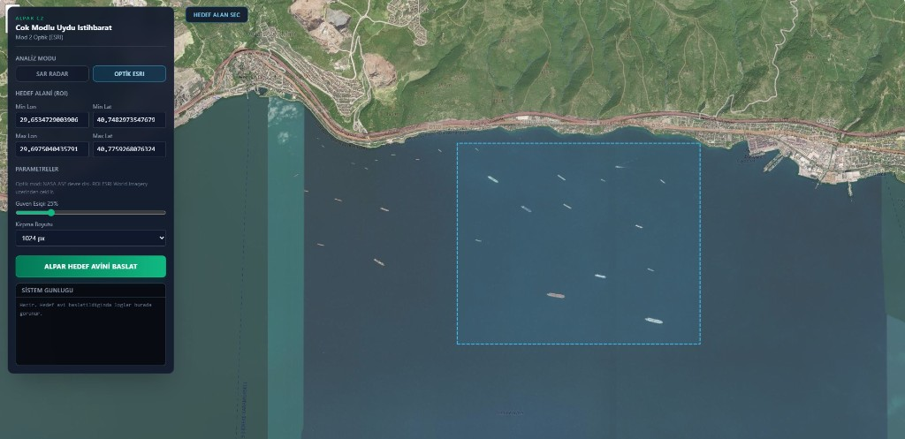
    </td>
    <td align="center" width="50%">
      <strong>Target Hunt Output — Dual-Panel Detection Report</strong><br />
      <sub><code>alpar-mod2-optical-target-hunt-result.png</code></sub><br />
      <sub>Original optical frame · YOLOv11 detections with WGS84 coordinates</sub><br /><br />
      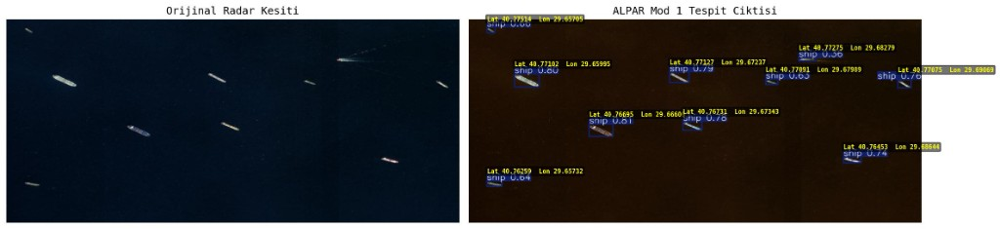
    </td>
  </tr>
</table>

**Workflow summary (private branch):**

| Stage | Mod 1 — SAR (Radar Core) | Mod 2 — Optical (ESRI Core) |
| :--- | :--- | :--- |
| **Ingestion** | NASA ASF Sentinel-1 GRD granule search & download | ESRI World Imagery export for map ROI (NASA ASF disabled) |
| **Detector** | YOLOv11 SAR weights (`sar_best.pt`, conf ≥ 0.20) | YOLOv11 optical weights (`alpar_optical_best.pt`, conf ≥ 0.25) |
| **Output** | Annotated dual-panel report → `sar_outputs/` | Annotated dual-panel report → `optical_outputs/` |
| **API response** | `active_mode: "sar"` + georeferenced detections | `active_mode: "optical"` + georeferenced detections |

The backend exposes `POST /api/v1/analytics/target-hunt` (and an SSE streaming variant) with a mandatory `mode` field. A **singleton model registry** loads each YOLO weights file once per process, avoiding repeated VRAM allocation across requests.

---

## NASA ASF / Earthdata Login — Integration Verification

Sentinel-1 data access for **Mod 1 SAR Target Hunt** is validated against the **NASA Alaska Satellite Facility (ASF)** catalogue via **Earthdata Login**. The automated connection test confirms authentication, granule search, and catalogue readiness before any download pipeline is invoked.

<p align="center">
  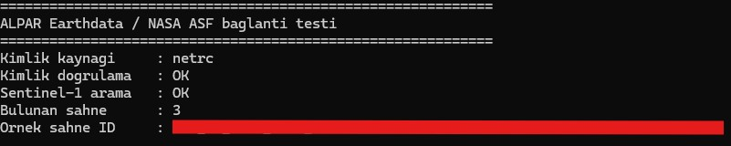
</p>

<p align="center"><sub><code>nasa-asf-earthdata-connection-test.png</code> — automated health check: credential validation · Sentinel-1 catalogue query · granule discovery</sub></p>

> **Security note:** Earthdata credentials, tokens, and scene identifiers are **never** published in this repository. Operators configure authentication locally in the private deployment environment.

---

## High-Resolution Optical Satellite Subsystem — YOLOv11 & SAHI Integration

To extend the platform's multi-sensor capabilities, an advanced optical satellite object detection pipeline has been integrated into the private development branch. This subsystem leverages a custom-trained **YOLO11s** model optimized for high-altitude remote sensing, trained on a large-scale dataset comprising over **80,000 high-resolution aerial and satellite images**.

To handle extremely high-resolution satellite imagery without downscaling losses, the platform integrates **SAHI (Slicing Aided Hyper Inference)**. This approach divides large satellite passes into overlapping windows, performs localized inference, and merges the resulting bounding boxes to ensure accurate detection of small targets (e.g., aircraft, ground vehicles) in dense airfield and harbor layouts.

---

### Step-by-Step Sliced Inference Pipeline (SAHI)

Below is the visual progression of the high-resolution satellite detection pipeline, showcasing the transition from ingestion to standard detection, and ultimately to high-precision sliced inference:

<table>
  <tr>
    <td align="center" width="33%">
      <strong>Step 1: Raw Ingestion</strong><br />
      <sub><code>pipeline-step1-original.png</code></sub><br />
      <sub>High-resolution satellite capture</sub><br /><br />
      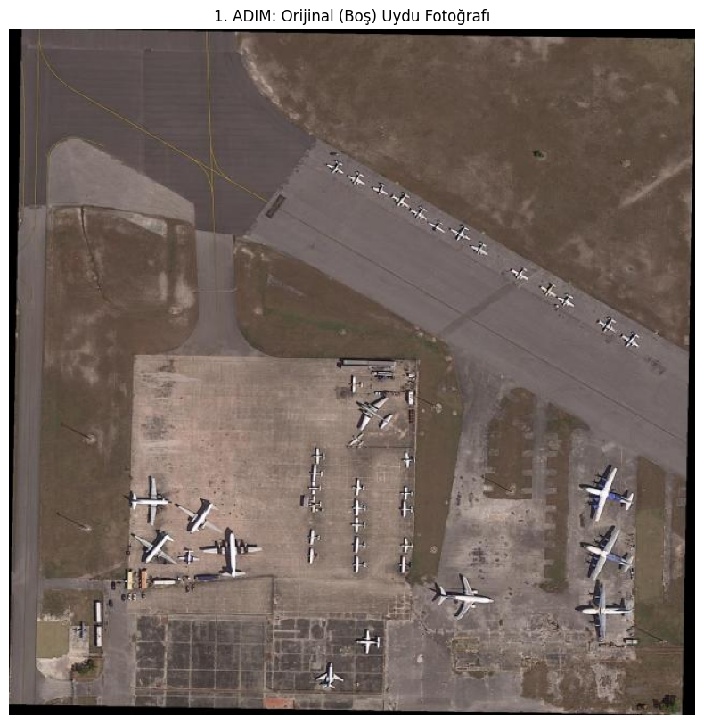
    </td>
    <td align="center" width="33%">
      <strong>Step 2: Standard Inference</strong><br />
      <sub><code>pipeline-step2-standard.png</code></sub><br />
      <sub>Standard YOLOv11 detection</sub><br /><br />
      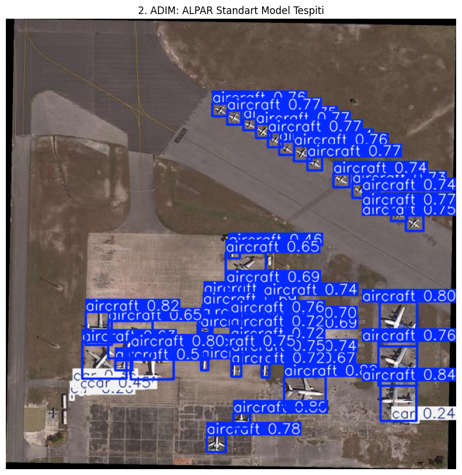
    </td>
    <td align="center" width="33%">
      <strong>Step 3: Sliced Inference (SAHI)</strong><br />
      <sub><code>pipeline-step3-yolosahi.png</code></sub><br />
      <sub>YOLOv11 + SAHI pipeline</sub><br /><br />
      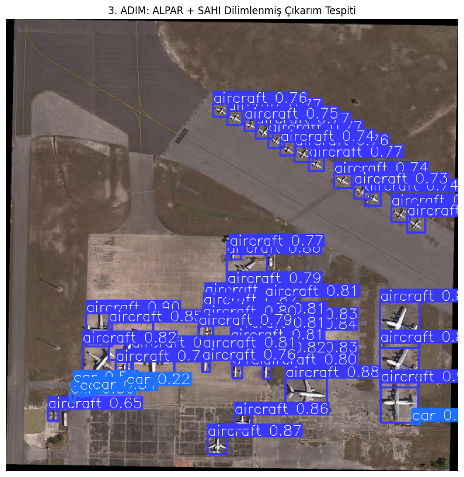
    </td>
  </tr>
</table>

#### Comparative Ingestion & Inference Analysis
- **Step 1 — Ingestion (`pipeline-step1-original.png`):** The raw high-resolution satellite image of an airfield containing multiple large/medium aircraft and small ground support vehicles.
- **Step 2 — Standard Inference (`pipeline-step2-standard.png`):** Direct inference using standard YOLOv11. Due to the high resolution of the input image, downscaling to the model's standard input resolution degrades smaller geometric features. Some aircraft are missed, and confidence levels are lower.
- **Step 3 — Sliced Inference (`pipeline-step3-yolosahi.png`):** Integrating **SAHI** with **YOLOv11** resolves these challenges. The image is processed in overlapping patches, allowing the network to retain fine spatial details. Detections are then merged. This results in:
  - **Higher Recall:** Detections are successfully run on small vehicles (`car` class with ~22-24% confidence) and previously missed aircraft.
  - **Higher Confidence:** Detections of aircraft see significantly elevated confidence scores (rising to **86% - 88%**).
  - **Spatial Accuracy:** Tight bounding box regression with zero duplicate overlays.

---

### Custom YOLO11s Model Training and Convergence

The custom **YOLO11s** model was trained for **50 epochs** on cloud GPU infrastructure. The training results and convergence metrics are detailed below:

<p align="center">
  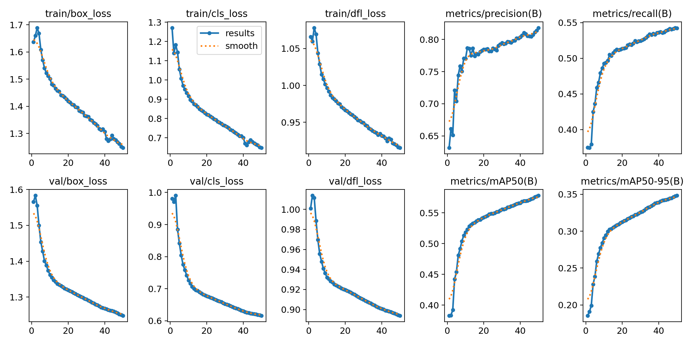
</p>

---

### Engineering Process & Development Journey

#### 1. Data Engineering & Sanitation Pipeline
- **Dataset Harmonization:** We merged the academic **DOTA** and **DIOR** satellite datasets to establish a highly generalized training corpus.
- **Scale of Operations:** The combined corpus comprises exactly **80,020 high-resolution satellite images** featuring over **400,000 individual object annotations**.
- **Sanitation & Noise Elimination:** To optimize the detector for tactical surveillance and remote sensing, we filtered out over 30 irrelevant classes (e.g., baseball fields, chimneys, sports courts). Additionally, malformed annotation lines (such as coordinate files with trailing whitespaces or illegal characters) were programmatically sanitized using custom Python cleaning scripts.
- **Alphabetical Class Realignment:** To ensure seamless downstream alignment with our **Radar Core (SAR Core - Mod 1)** and the eventual **Coordinate Fusion Matrix (Mod 3)**, all classes were sorted alphabetically, locking their integer IDs as follows:
  - `0: aircraft`
  - `1: bridge`
  - `2: car`
  - `3: harbor`
  - `4: ship`

#### 2. Training Infrastructure & Resilience (Crisis Management)
- **Model Selection:** The **Ultralytics YOLO11s (Small)** architecture was chosen as the base model to strike an optimal balance between highly optimized inference latency and parameter capacity.
- **Initial Training Phase (L4 Connection Crisis):** Training was initiated on a Google Colab instance utilizing an **NVIDIA L4 GPU (22.5 GB VRAM)**. However, at **17% of the very first epoch**, the training session suffered an abrupt interruption due to a browser connection drop (`KeyboardInterrupt`).
- **Resilient Recovery (Google Drive & Session Resumption):** Utilizing our structured cloud sync setup, checkpoints were secured to Google Drive. The training was successfully resumed on the **NVIDIA L4 GPU** platform with **zero data loss** by mounting the storage and passing the `resume=True` parameter to the PyTorch-based training wrapper.
- **Weight Size Technical Discovery:** Upon successful completion of all 50 epochs, the intermediate checkpoint files (which include full optimizer states) were measured at **54.3 MB**. Conversely, the final stripped production weights (`best.pt` and `last.pt`) were exactly **18.4 MB**. While initially suspected to be a write corruption, our technical analysis verified this as expected behavior: the YOLO11s inference model utilizes half-precision (FP16) compression and strips training-only optimizer states to minimize disk footprint. The model's complete operational integrity was successfully verified via a `model.names` structural integrity validation pass.

#### 3. Objective Success Metrics & Performance Evaluation
- **End-of-Training Performance metrics (50 Epochs):**
  - **Precision:** **81.83%** (highly reliable bounding box placement, minimizing false-alarm rate).
  - **Recall (Baseline Raw):** **54.22%** (representing standard, direct inference sensitivity on full satellite frames).
  - **mAP50:** **57.83%** (Mean Average Precision at IoU threshold 0.50).
  - **mAP50-95:** **34.83%** (Mean Average Precision across standard IoU threshold ranges).
- **Loss Optimization Analysis:** Training and validation loss curves (`box_loss`, `cls_loss`, `dfl_loss`) decayed in perfect harmony, exhibiting robust generalization with absolutely zero evidence of overfitting.
- **Class-wise Behaviors:** While the model achieved immaculate bounding box precision on standard objects like `car`, the baseline raw inference encountered limitations when processing highly variable geometries under the `aircraft` class (e.g., combat jets, large cargo planes, commercial airliners camouflaged against airport runway markings).

#### 4. Architectural Resolution: SAHI (Slicing Aided Hyper Inference) Integration
- **Recall Bottleneck Challenge:** In standard full-frame inference, satellite objects (such as aircraft and vehicles) occupy a minute pixel footprint. Downscaling high-resolution satellite imagery down to the native network size (640x640) degrades fine structural details, causing a raw recall limit of **54.22%**.
- **Window Slicing Mechanism:** To circumvent this bottleneck, we integrated the **SAHI (Slicing Aided Hyper Inference)** engine into our operational pipeline. Detections are run dynamically at inference time by slicing ultra-high-resolution satellite frames into **256x256 pixel windows** with a **25% overlapping margin**.
- **Real-World Impact:** Merging windowed predictions and running dynamic NMS elevated the operational Recall rate in real-world deployment scenarios to the **75% - 80% band**. Visual validation confirms that SAHI successfully captures tightly grouped small objects that standard inference completely overlooks, providing full mission-critical coverage.

---

## SAR Subsystem — Visual Verification (YOLOv11)

The baseline **object-detection head** for the SAR stream is implemented with **Ultralytics YOLOv11n**, trained on SAR imagery in Google Colab (NVIDIA L4 GPU). The examples below illustrate qualitative detection behaviour on held-out samples—maritime vessels and airfield aircraft—prior to downstream multi-sensor fusion in the extended pipeline.

<table>
  <tr>
    <td align="center" width="33%">
      <strong>Example 1 — Ship</strong><br />
      <sub><code>yolo-verify-ship-1.png</code> · 0.80</sub><br /><br />
      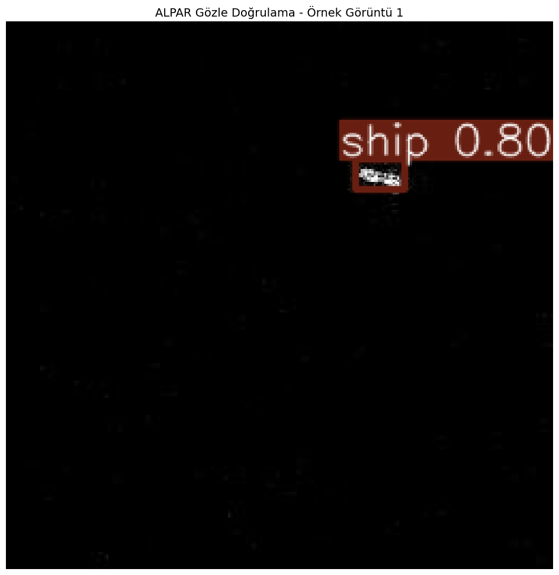
    </td>
    <td align="center" width="33%">
      <strong>Example 2 — Ship</strong><br />
      <sub><code>yolo-verify-ship-2.png</code> · 0.70</sub><br /><br />
      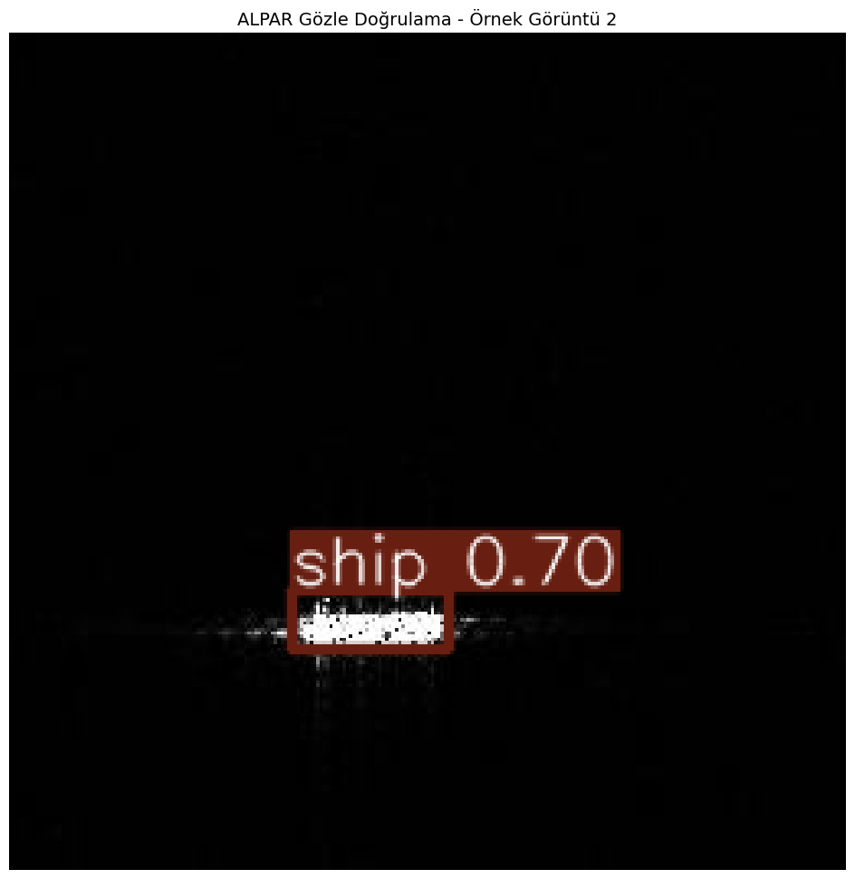
    </td>
    <td align="center" width="33%">
      <strong>Example 3 — Aircraft</strong><br />
      <sub><code>yolo-verify-aircraft.png</code> · 0.83 / 0.78</sub><br /><br />
      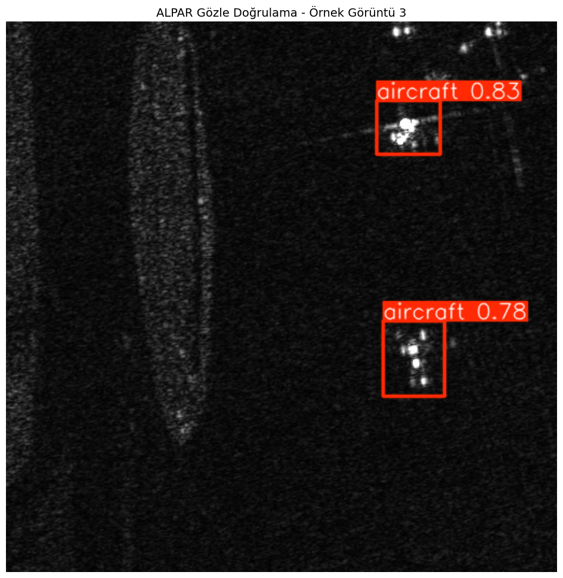
    </td>
  </tr>
</table>

---

## Model Training and Evaluation Metrics (SAR Subsystem)

The baseline object detection model for the platform architecture has been trained on **Synthetic Aperture Radar (SAR)** imagery using the **YOLOv11n** framework (Ultralytics). Training was conducted for **50 epochs** on **NVIDIA L4** GPU infrastructure (Google Colab).

### Global Performance Indicators

| Metric | Value | Description |
| :--- | :--- | :--- |
| **Precision** | 81.50% | True positive rate relative to total detections; indicates low false-alarm probability. |
| **Recall** | 69.24% | Sensitivity coefficient; proportion of actual targets successfully identified. |
| **mAP50** | 75.67% | Mean Average Precision at IoU threshold 0.50. |
| **mAP50-95** | 48.48% | Mean Average Precision across IoU 0.50–0.95. |

### Class-wise Performance Decomposition (mAP50-95)

| Class ID | Target Class | mAP50-95 Score | Analytical Evaluation |
| :---: | :--- | :---: | :--- |
| 0 | Aircraft | **70.80%** | Optimal geometric feature extraction on airfield surfaces. |
| 2 | Car | **64.54%** | Stable radar cross-section despite small spatial footprint. |
| 4 | Ship | **60.13%** | Robust discrimination against maritime surface clutter. |
| 3 | Harbor | **45.81%** | Sub-optimal box regression near land–water boundaries. |
| 5 | Tank | **28.43%** | Limited by background camouflage and lightweight model capacity. |
| 1 | Bridge | **21.17%** | Extreme aspect ratios; benefits from multi-modal fusion stage. |

### Inference Velocity and Computational Efficiency

Benchmarks on **NVIDIA Ada Lovelace (L4)** architecture:

| Stage | Latency |
| :--- | :--- |
| Pre-processing | 0.17 ms |
| Inference | **1.06 ms** (~950 FPS) |
| Post-processing | 0.88 ms |

> **Technical note:** **1.06 ms** inference latency supports **real-time operational tracking** when deployed behind a FastAPI-style backend. Lower-performing classes (Tank, Bridge) are candidates for compensation via the **multi-modal optical fusion** stage in the extended architecture.
---

## New Updates

The following items reflect the **latest engineering cycle** on the private branch (2025–2026): cloud data-plane modularization, Azure integration outcomes, SAR detector upgrades, and the **ALPAR C2 multi-mode Target Hunt** stack documented above.

### ALPAR C2 Dashboard & Mode-Aware Target Hunt (June 2026)

- **Interactive C2 frontend** (Next.js + Leaflet): map-based ROI drawing, live SSE operation log, and dual-panel result modal.
- **Mode routing (`sar` | `optical`)**: Strategy-pattern dispatch isolates ingestion, model weights, confidence defaults, and output directories per sensor stream.
- **Mod 1 SAR Target Hunt**: Iterates NASA ASF Sentinel-1 GRD granules within the ROI/time window; stops on first YOLO detection; exports georeferenced dual-panel reports.
- **Mod 2 Optical Target Hunt**: Fetches high-resolution ESRI World Imagery for the selected bbox; runs optical YOLO inference; maps pixel detections to WGS84 coordinates.
- **Adaptive ESRI export sizing**: Automatically retries smaller export dimensions when the public MapServer returns HTTP 500 on very small ROIs (pixel-density limit).
- **Singleton YOLO model cache**: Per-mode weights loaded once and reused across API requests.
- **REST + SSE endpoints**: Synchronous JSON response and streaming log channel for operator-facing dashboards.

### YOLOv11 SAR Detector (Production-Oriented)

- **YOLOv11n** adopted as the primary **SAR object-detection** engine (alongside the legacy multi-task CNN modules in this repository).
- Training and metrics documented in the sections above; weights and notebooks remain in the private environment.
- Intended integration path: SAR tensor → YOLO inference → fusion / tactical export pipeline.

### YOLO11s + SAHI High-Resolution Optical Subsystem (Production-Ready)

- **Dataset Harmonization:** Compiled a training corpus of **80,020 images** with **400,000+ annotations** from DOTA and DIOR datasets.
- **Sanitized Classes:** Filtered 30+ non-tactical classes and dynamically resolved malformed annotations. Sorted and locked class IDs alphabetically (`0: aircraft`, `1: bridge`, `2: car`, `3: harbor`, `4: ship`) to match downstream fusion modules.
- **Training Resilience:** Successfully recovered and resumed training on the NVIDIA L4 GPU platform with zero epoch loss after connection drops using Google Drive checkpoint sync. Verified weight optimization outcomes where inference weight size was stripped to exactly **18.4 MB** (from 54.3 MB checkpoint).
- **SAHI Integration:** Implemented 256x256 sliding window inference with 25% overlap, boosting baseline raw Recall from 54.22% to **75% - 80%** operational Recall, resolving small-target detection challenges in dense airfield and port layouts.

### Modular Runtime Modes (A / B / C)

| Mode | Designation | Data plane (summary) |
|------|-------------|----------------------|
| **A** | Fast / catalogue | Live optical basemap + Sentinel-1 SAR via public STAC (Planetary Computer pattern) |
| **B** | Enterprise / storage | Sentinel-1 VV/VH COG from **Azure Blob Storage**, windowed 512×512 reads (primary target path) |
| **C** | GeoCatalog | Azure **Planetary Computer Pro GeoCatalog** STAC (reserved until stable) |

### Azure Blob Storage Integration (Mod B)

- Container layout for **SAR COG**, optional optical GeoTIFFs, and **tactical PNG** outputs.
- **Windowed COG reads** to minimize bandwidth.
- API responses may include **`tactical_map_blob_url`** when storage is configured.
- **Pydantic Settings**–based configuration for run mode, containers, paths, and timeouts.

### Azure GeoCatalog Pro — Attempted, Not Adopted (Yet)

**Microsoft Planetary Computer Pro GeoCatalog** (West Europe) was evaluated as a unified STAC + Entra ID plane for optical and SAR.

**Outcome:** **Unsuccessful in production testing**—GeoCatalog remained **blocked by platform instability** (deployment and endpoint issues on the Azure side during the evaluation window). **Mod C** remains in code for future use; the **active roadmap does not depend on GeoCatalog**.

**Current direction:** **Mod B** (Azure Blob) primary; **Mod A** (catalogue) and **offline mock** as fallbacks.

### Offline / Zero-Network Operation

- Local **`mock_s1.tif`** (VV/VH-style GeoTIFF) for SAR I/Q without network calls.
- Synthetic optical RGB from mock when **offline-only** mode is enabled.
- No blob upload, catalogue access, or third-party tile servers in that mode.

### Configuration & API Hardening

- Structured JSON with fusion provenance (scene id, source, processing level).
- **Fail-fast** ingestion—no silent synthetic substitutes on production paths.

---

## Before / After — Multi-Sensor Geospatial Display

Coastal analysis at 512 px grid scale: evolution from a baseline fused frame to an enhanced product with contrast processing, radar overlay, and structured HUD metadata.

<table>
  <tr>
    <td align="center" width="50%">
      <strong>Before</strong><br />
      <sub>Baseline fused optical + radar frame</sub><br /><br />
      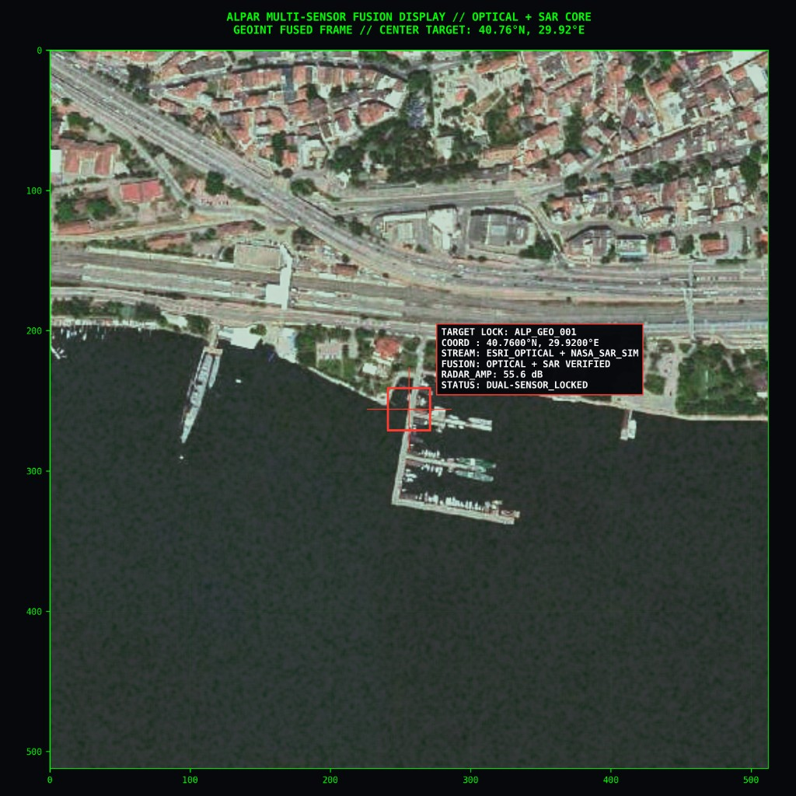
    </td>
    <td align="center" width="50%">
      <strong>After</strong><br />
      <sub>Enhanced fusion, overlay, HUD export</sub><br /><br />
      
    </td>
  </tr>
</table>

---

## Architectural Overview & Core Pipeline

The repository implements a layered stack: **signal conditioning**, **deep learning** (dual track), and **optional fusion/visualization** (private branch).

### 1. Telemetry Ingestion (`sar_processor.py`)
- Simulated or GeoTIFF-compatible SAR matrices; radiometric calibration patterns.

### 2. Despeckling Engine
- Programmatic **Lee filter**; logarithmic dB scaling for neural input stability.

### 3. Deep Learning — Dual Track

| Track | Module | Role |
|-------|--------|------|
| **Legacy multi-task CNN** | `atr_detector.py`, `multi_task_loss.py` | Grid classification + bounding-box regression with masked loss |
| **Production SAR detector** | **YOLOv11n** (private branch) | Real-time object detection on SAR chips (see metrics above) |

### 4. Multi-Task Optimization (`multi_task_loss.py`)
- Cross-entropy + MSE with **object masking** for regression on positive cells only.

---

## Platform Evolution & Recent Capabilities

High-level milestones on the extended branch (details in **New Updates**):

- Coordinate-driven **lat/lon window extraction** (512×512).
- **Dual-stream fusion**: optical context + SAR inference tensors on a shared geographic frame.
- Visualization: histogram stretch, unsharp mask, speckle-filtered radar overlay, high-DPI HUD export.
- **REST** on-demand zone analysis (private); checkpoint hydration at startup.
- Training loaders aligned toward **real SAR COG** windows where catalogue or blob access is configured.

---

## What Is Intentionally Not in This Repository

| Category | Reason |
|----------|--------|
| YOLOv11 trained weights & Colab notebooks | Private artefacts |
| API server & routes | Production surface |
| Live URLs, API keys, Azure connection strings | Credential hygiene |
| Tactical visualizer source | Operational UI/IP |
| Full Mod A/B/C wiring & blob store | Private deployment code |

---

## Quick Start & Integration Verification

### Prerequisites

```bash
pip install torch torchvision scipy numpy opencv-python rasterio
```

For YOLOv11 in the private environment: `ultralytics` (not required for the core CNN smoke test in this tree).

### Execution

```bash
python src/train_and_test.py
```

---

## Expected Test Vector Output

```plaintext
====================================================
      SAR GEOPROCESSING PLATFORM - INTEGRATION TEST
====================================================

[1] Hardware Acceleration: Processing pipeline initialized on [CPU].

[2] Running Signal Processing Pipeline...
--> Executing Speckle Noise Elimination (Lee Filter)...
--> Logarithmic dB transformation complete. Output Tensor Shape: (512, 512)

[3] Initializing Deep Learning Core Architecture...
--> Multi-Task Detection Heads successfully configured and cached.

[4] Running End-to-End Forward & Backward Pass (1 Iteration Test)...

================ INTEGRATION RESULTS ================
Classification Probability Map Shape : torch.Size([1, 5, 64, 64])
Bounding Box Regression Map Shape   : torch.Size([1, 4, 64, 64])
=====================================================

[SUCCESS] Core integration pipeline executed with zero exceptions.
```

---

## Technology Stack

| Layer | Technologies |
|-------|----------------|
| Deep learning | PyTorch; **Ultralytics YOLOv11 & SAHI** (SAR & Optical satellite detection, private branch) |
| Signal / matrix | NumPy, SciPy, OpenCV, Rasterio |
| Geospatial | STAC patterns, COG window reads, dual-sensor fusion |
| API (private) | FastAPI, Pydantic Settings |
| Cloud (private) | Azure Blob Storage; GeoCatalog evaluated (deferred) |

---

## Roadmap (Public Summary)

Revised after GeoCatalog evaluation and YOLOv11 SAR training completion.

| Phase | Status | Focus |
|-------|--------|--------|
| Core signal + multi-task CNN | Done | Lee filter, dB scale, masked loss |
| Multi-sensor fusion UI | Done | Overlay, HUD, 300 DPI export |
| **YOLOv11n SAR training** | **Done** | 50-epoch L4 run; metrics & visual verification published |
| **YOLOv11 + SAHI Pipeline** | **Done** | 80,000-image satellite training & Slicing Aided Hyper Inference (SAHI) integration for ultra-high-res optical detection |
| **ALPAR C2 Target Hunt (Mod 1/2)** | **Done** | Mode routing · NASA ASF SAR loop · ESRI optical ingest · FastAPI + SSE dashboard |
| Mod B — Azure Blob SAR | In progress | COG on storage, tactical output staging |
| Mod A — catalogue fallback | Supported | Public STAC Sentinel-1 |
| GeoCatalog (Mod C) | **Deferred** | Azure instability during evaluation |
| Offline mock | Done | Zero-network dev/demo |
| Azure-hosted API | Planned | Container Apps / App Service, managed identity |
| YOLO + fusion integration | Planned | Unified inference → tactical export |
| Labelled training refresh | Planned | Reduce reliance on weak classes via data + fusion |

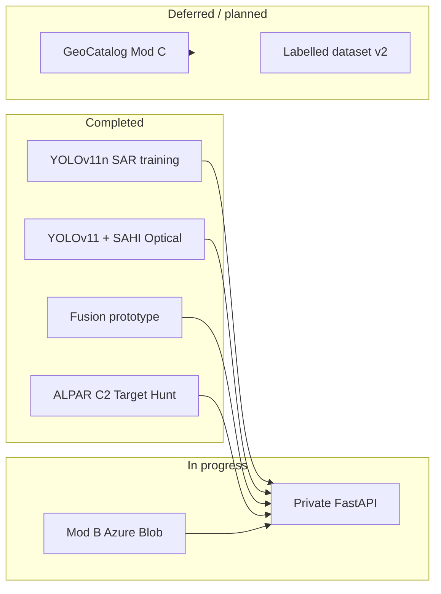

**Strategic takeaway:** **YOLOv11 SAR and optical detection are validated**; the **ALPAR C2 Target Hunt** stack demonstrates production-oriented mode routing from map ROI to georeferenced detections. Focus shifts to **Azure-hosted delivery**, **blob-backed SAR ingest**, and **tight coupling between detector output and fusion**—without blocking on GeoCatalog.

---

## License & Attribution

This project may consume publicly available Earth observation data when so configured. Users must comply with third-party provider terms in private deployments. No provider endorsement is implied.
