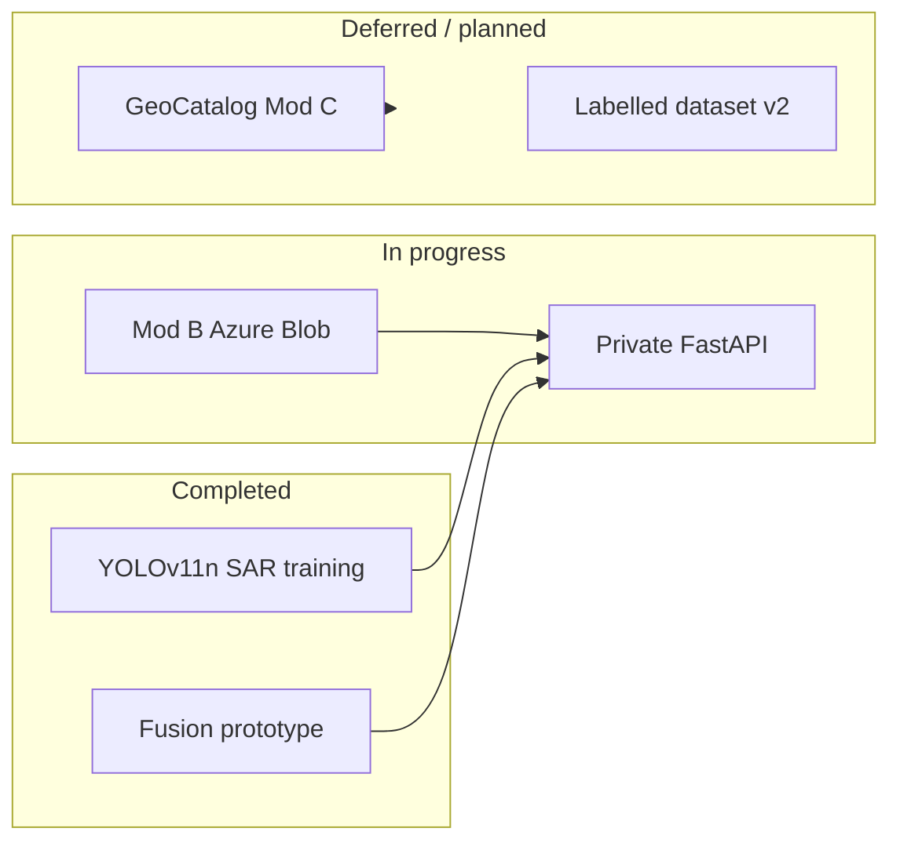

# SAR Geoprocessing & Automated Core Platform

A modular, microservice-ready geospatial platform for Synthetic Aperture Radar (SAR) preprocessing, object detection, and multi-sensor geospatial fusion. This public repository documents the foundational pipeline and recent validation results for civilian remote sensing use cases—including environmental monitoring, disaster response, and coastal infrastructure analysis.

> **Note:** This repository contains **open-source-safe** core modules and public reporting artefacts. Production API routes, credentials, full tactical visualizer sources, and trained weight files are maintained in a **private development environment** and are summarized here at a high level only.

---

## SAR Subsystem — Visual Verification (YOLOv11)

The baseline **object-detection head** for the SAR stream is implemented with **Ultralytics YOLOv11n**, trained on SAR imagery in Google Colab (NVIDIA L4 GPU). The examples below illustrate qualitative detection behaviour on held-out samples—maritime vessels and airfield aircraft—prior to downstream multi-sensor fusion in the extended pipeline.

<table>
  <tr>
    <td align="center" width="33%">
      <strong>Example 1 — Ship</strong><br />
      <sub><code>yolo-verify-ship-1.png</code> · 0.80</sub><br /><br />
      
    </td>
    <td align="center" width="33%">
      <strong>Example 2 — Ship</strong><br />
      <sub><code>yolo-verify-ship-2.png</code> · 0.70</sub><br /><br />
      
    </td>
    <td align="center" width="33%">
      <strong>Example 3 — Aircraft</strong><br />
      <sub><code>yolo-verify-aircraft.png</code> · 0.83 / 0.78</sub><br /><br />
      
    </td>
  </tr>
</table>

---

## Model Training and Evaluation Metrics (SAR Subsystem)

The baseline object detection model for the platform architecture has been trained on **Synthetic Aperture Radar (SAR)** imagery using the **YOLOv11n** framework (Ultralytics). Training was conducted for **50 epochs** on **NVIDIA L4** GPU infrastructure (Google Colab).

### Global Performance Indicators

| Metric | Value | Description |
| :--- | :--- | :--- |
| **Precision** | 81.50% | True positive rate relative to total detections; indicates low false-alarm probability. |
| **Recall** | 69.24% | Sensitivity coefficient; proportion of actual targets successfully identified. |
| **mAP50** | 75.67% | Mean Average Precision at IoU threshold 0.50. |
| **mAP50-95** | 48.48% | Mean Average Precision across IoU 0.50–0.95. |

### Class-wise Performance Decomposition (mAP50-95)

| Class ID | Target Class | mAP50-95 Score | Analytical Evaluation |
| :---: | :--- | :---: | :--- |
| 0 | Aircraft | **70.80%** | Optimal geometric feature extraction on airfield surfaces. |
| 2 | Car | **64.54%** | Stable radar cross-section despite small spatial footprint. |
| 4 | Ship | **60.13%** | Robust discrimination against maritime surface clutter. |
| 3 | Harbor | **45.81%** | Sub-optimal box regression near land–water boundaries. |
| 5 | Tank | **28.43%** | Limited by background camouflage and lightweight model capacity. |
| 1 | Bridge | **21.17%** | Extreme aspect ratios; benefits from multi-modal fusion stage. |

### Inference Velocity and Computational Efficiency

Benchmarks on **NVIDIA Ada Lovelace (L4)** architecture:

| Stage | Latency |
| :--- | :--- |
| Pre-processing | 0.17 ms |
| Inference | **1.06 ms** (~950 FPS) |
| Post-processing | 0.88 ms |

> **Technical note:** **1.06 ms** inference latency supports **real-time operational tracking** when deployed behind a FastAPI-style backend. Lower-performing classes (Tank, Bridge) are candidates for compensation via the **multi-modal optical fusion** stage in the extended architecture.

---

## New Updates

The following items reflect the **latest engineering cycle** on the private branch (2025–2026): cloud data-plane modularization, Azure integration outcomes, and SAR detector upgrades—including **YOLOv11n** training above.

### YOLOv11 SAR Detector (Production-Oriented)

- **YOLOv11n** adopted as the primary **SAR object-detection** engine (alongside the legacy multi-task CNN modules in this repository).
- Training and metrics documented in the sections above; weights and notebooks remain in the private environment.
- Intended integration path: SAR tensor → YOLO inference → fusion / tactical export pipeline.

### Modular Runtime Modes (A / B / C)

| Mode | Designation | Data plane (summary) |
|------|-------------|----------------------|
| **A** | Fast / catalogue | Live optical basemap + Sentinel-1 SAR via public STAC (Planetary Computer pattern) |
| **B** | Enterprise / storage | Sentinel-1 VV/VH COG from **Azure Blob Storage**, windowed 512×512 reads (primary target path) |
| **C** | GeoCatalog | Azure **Planetary Computer Pro GeoCatalog** STAC (reserved until stable) |

### Azure Blob Storage Integration (Mod B)

- Container layout for **SAR COG**, optional optical GeoTIFFs, and **tactical PNG** outputs.
- **Windowed COG reads** to minimize bandwidth.
- API responses may include **`tactical_map_blob_url`** when storage is configured.
- **Pydantic Settings**–based configuration for run mode, containers, paths, and timeouts.

### Azure GeoCatalog Pro — Attempted, Not Adopted (Yet)

**Microsoft Planetary Computer Pro GeoCatalog** (West Europe) was evaluated as a unified STAC + Entra ID plane for optical and SAR.

**Outcome:** **Unsuccessful in production testing**—GeoCatalog remained **blocked by platform instability** (deployment and endpoint issues on the Azure side during the evaluation window). **Mod C** remains in code for future use; the **active roadmap does not depend on GeoCatalog**.

**Current direction:** **Mod B** (Azure Blob) primary; **Mod A** (catalogue) and **offline mock** as fallbacks.

### Offline / Zero-Network Operation

- Local **`mock_s1.tif`** (VV/VH-style GeoTIFF) for SAR I/Q without network calls.
- Synthetic optical RGB from mock when **offline-only** mode is enabled.
- No blob upload, catalogue access, or third-party tile servers in that mode.

### Configuration & API Hardening

- Structured JSON with fusion provenance (scene id, source, processing level).
- **Fail-fast** ingestion—no silent synthetic substitutes on production paths.

---

## Before / After — Multi-Sensor Geospatial Display

Coastal analysis at 512 px grid scale: evolution from a baseline fused frame to an enhanced product with contrast processing, radar overlay, and structured HUD metadata.

<table>
  <tr>
    <td align="center" width="50%">
      <strong>Before</strong><br />
      <sub>Baseline fused optical + radar frame</sub><br /><br />
      
    </td>
    <td align="center" width="50%">
      <strong>After</strong><br />
      <sub>Enhanced fusion, overlay, HUD export</sub><br /><br />
      
    </td>
  </tr>
</table>

---

## Architectural Overview & Core Pipeline

The repository implements a layered stack: **signal conditioning**, **deep learning** (dual track), and **optional fusion/visualization** (private branch).

### 1. Telemetry Ingestion (`sar_processor.py`)
- Simulated or GeoTIFF-compatible SAR matrices; radiometric calibration patterns.

### 2. Despeckling Engine
- Programmatic **Lee filter**; logarithmic dB scaling for neural input stability.

### 3. Deep Learning — Dual Track

| Track | Module | Role |
|-------|--------|------|
| **Legacy multi-task CNN** | `atr_detector.py`, `multi_task_loss.py` | Grid classification + bounding-box regression with masked loss |
| **Production SAR detector** | **YOLOv11n** (private branch) | Real-time object detection on SAR chips (see metrics above) |

### 4. Multi-Task Optimization (`multi_task_loss.py`)
- Cross-entropy + MSE with **object masking** for regression on positive cells only.

---

## Platform Evolution & Recent Capabilities

High-level milestones on the extended branch (details in **New Updates**):

- Coordinate-driven **lat/lon window extraction** (512×512).
- **Dual-stream fusion**: optical context + SAR inference tensors on a shared geographic frame.
- Visualization: histogram stretch, unsharp mask, speckle-filtered radar overlay, high-DPI HUD export.
- **REST** on-demand zone analysis (private); checkpoint hydration at startup.
- Training loaders aligned toward **real SAR COG** windows where catalogue or blob access is configured.

---

## What Is Intentionally Not in This Repository

| Category | Reason |
|----------|--------|
| YOLOv11 trained weights & Colab notebooks | Private artefacts |
| API server & routes | Production surface |
| Live URLs, API keys, Azure connection strings | Credential hygiene |
| Tactical visualizer source | Operational UI/IP |
| Full Mod A/B/C wiring & blob store | Private deployment code |

---

## Quick Start & Integration Verification

### Prerequisites

```bash
pip install torch torchvision scipy numpy opencv-python rasterio
```

For YOLOv11 in the private environment: `ultralytics` (not required for the core CNN smoke test in this tree).

### Execution

```bash
python src/train_and_test.py
```

---

## Expected Test Vector Output

```plaintext
====================================================
      SAR GEOPROCESSING PLATFORM - INTEGRATION TEST
====================================================

[1] Hardware Acceleration: Processing pipeline initialized on [CPU].

[2] Running Signal Processing Pipeline...
--> Executing Speckle Noise Elimination (Lee Filter)...
--> Logarithmic dB transformation complete. Output Tensor Shape: (512, 512)

[3] Initializing Deep Learning Core Architecture...
--> Multi-Task Detection Heads successfully configured and cached.

[4] Running End-to-End Forward & Backward Pass (1 Iteration Test)...

================ INTEGRATION RESULTS ================
Classification Probability Map Shape : torch.Size([1, 5, 64, 64])
Bounding Box Regression Map Shape   : torch.Size([1, 4, 64, 64])
=====================================================

[SUCCESS] Core integration pipeline executed with zero exceptions.
```

---

## Technology Stack

| Layer | Technologies |
|-------|----------------|
| Deep learning | PyTorch; **Ultralytics YOLOv11** (SAR detection, private branch) |
| Signal / matrix | NumPy, SciPy, OpenCV, Rasterio |
| Geospatial | STAC patterns, COG window reads, dual-sensor fusion |
| API (private) | FastAPI, Pydantic Settings |
| Cloud (private) | Azure Blob Storage; GeoCatalog evaluated (deferred) |

---

## Roadmap (Public Summary)

Revised after GeoCatalog evaluation and YOLOv11 SAR training completion.

| Phase | Status | Focus |
|-------|--------|--------|
| Core signal + multi-task CNN | Done | Lee filter, dB scale, masked loss |
| Multi-sensor fusion UI | Done | Overlay, HUD, 300 DPI export |
| **YOLOv11n SAR training** | **Done** | 50-epoch L4 run; metrics & visual verification published |
| Mod B — Azure Blob SAR | In progress | COG on storage, tactical output staging |
| Mod A — catalogue fallback | Supported | Public STAC Sentinel-1 |
| GeoCatalog (Mod C) | **Deferred** | Azure instability during evaluation |
| Offline mock | Done | Zero-network dev/demo |
| Azure-hosted API | Planned | Container Apps / App Service, managed identity |
| YOLO + fusion integration | Planned | Unified inference → tactical export |
| Labelled training refresh | Planned | Reduce reliance on weak classes via data + fusion |



**Strategic takeaway:** **YOLOv11 SAR detection is validated**; focus shifts to **Azure-hosted delivery**, **blob-backed SAR ingest**, and **tight coupling between detector output and fusion**—without blocking on GeoCatalog.

---

## License & Attribution

This project may consume publicly available Earth observation data when so configured. Users must comply with third-party provider terms in private deployments. No provider endorsement is implied.
