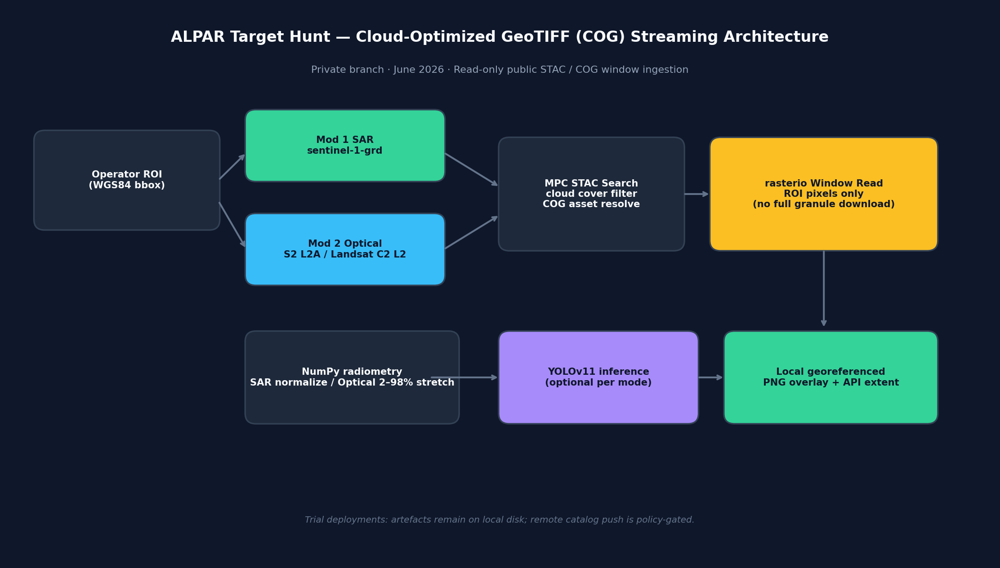
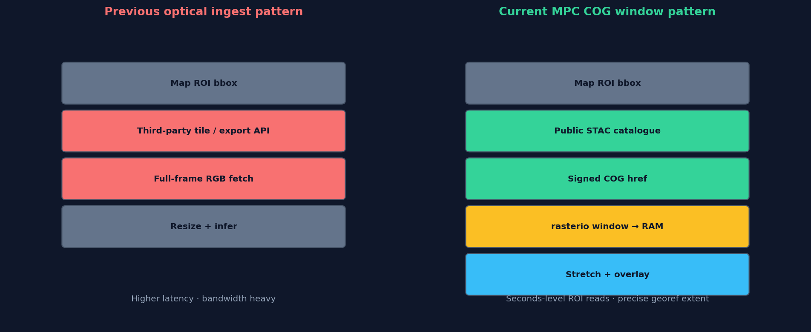
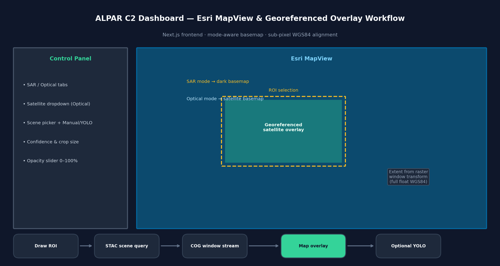
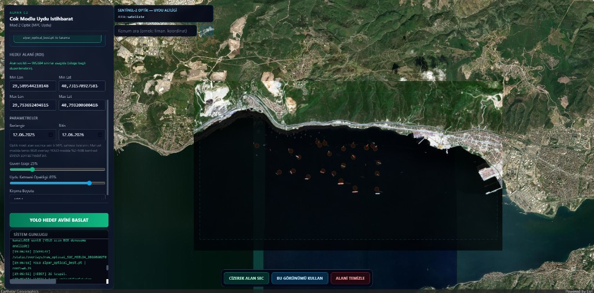
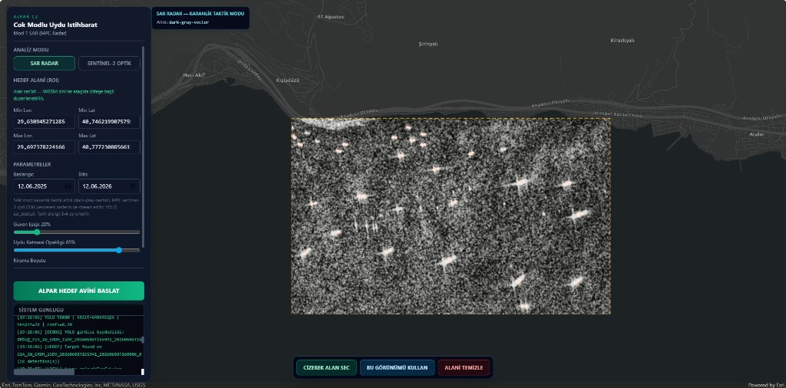
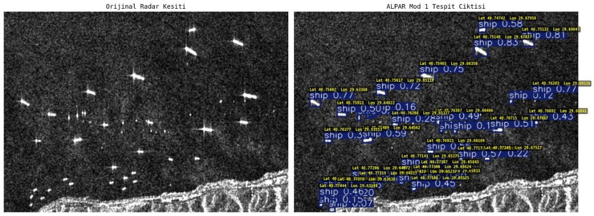
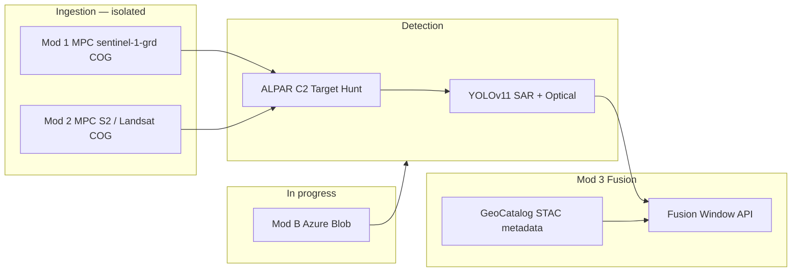

# SAR Geoprocessing & Automated Core Platform

A modular, microservice-ready geospatial platform for Synthetic Aperture Radar (SAR) preprocessing, object detection, and multi-sensor geospatial fusion. This public repository documents the foundational pipeline and recent validation results for civilian remote sensing use cases—including environmental monitoring, disaster response, and coastal infrastructure analysis.

> **Note:** This repository contains **open-source-safe** core modules and public reporting artefacts. Production API routes, credentials, full tactical visualizer sources, and trained weight files are maintained in a **private development environment** and are summarized here at a high level only.

---

## Engineering Release Report — June 2026 (Private Branch Summary)

This section documents the **latest validated engineering cycle** on the private ALPAR stack: unified **Cloud-Optimized GeoTIFF (COG) streaming** for both SAR and optical Target Hunt modes, an **Esri-native C2 map frontend**, sub-pixel **WGS84 overlay alignment**, and a **local-first trial policy** that avoids remote catalog writes during development.

### Executive summary

| Area | Previous baseline (public README) | Current validated behaviour (private branch) |
| :--- | :--- | :--- |
| **Mod 1 SAR ingest** | NASA ASF granule search & download | **Microsoft Planetary Computer** `sentinel-1-grd` STAC + **rasterio window read** (ROI pixels only) |
| **Mod 2 Optical ingest** | Third-party map imagery export for ROI | **MPC STAC** — `sentinel-2-l2a` or **Landsat Collection 2 L2** with operator-selectable satellite dropdown |
| **Data transfer model** | Full-frame or export API pulls | **COG HTTP range reads** into RAM — no whole-scene download required for hunt |
| **C2 frontend** | Leaflet-based ROI dashboard | **Next.js + Esri ArcGIS MapView** — tactical basemap auto-switch, georeferenced overlay, opacity control |
| **Overlay georef** | Bounding-box approximation | Extent derived from **rasterio window affine** — full floating-point WGS84 returned to the map layer |
| **Optical visualization** | Standard inference frame | Per-band **2nd–98th percentile contrast stretch** on raw multispectral COG bands (no cloud masking) |
| **Trial / dev policy** | Remote catalog & blob staging enabled when configured | **Configurable cloud-write gate** — local PNG overlays only; remote STAC push and blob upload bypassed |

> **Security & operations note:** Deployment credentials, storage account identifiers, Entra application IDs, internal collection names, and weight artefacts are **not** published here. Operators configure authentication and cloud policies only in the private environment.

### COG streaming architecture (Mod 1 + Mod 2)

<p align="center">
  
</p>

<p align="center"><sub><code>alpar-mpc-cog-streaming-architecture.png</code> — unified read-only ingestion: STAC discovery → signed COG asset → rasterio ROI window → radiometry → optional YOLO → local georeferenced overlay</sub></p>

**Technical highlights (public-safe):**

- **STAC-first discovery** on the public Planetary Computer catalogue with **cloud-cover filtering** for optical collections.
- **Band mapping by sensor:** Sentinel-2 true-colour (red / green / blue COG assets); Landsat C2 L2 equivalent RGB assets — selected from the optical dropdown.
- **Windowed COG reads** via `rasterio` — only the operator ROI is materialized in memory.
- **SAR radiometry** normalizes GRD backscatter for visual overlay; **optical radiometry** applies per-band percentile stretch so clouds and open water remain visually interpretable without semantic masking.
- **Singleton YOLO registry** unchanged — one weights load per sensor mode per API process.

### Ingestion paradigm shift (optical)

<p align="center">
  
</p>

<p align="center"><sub><code>alpar-ingestion-paradigm-comparison.png</code> — conceptual comparison: full-frame export latency vs ROI-scoped COG streaming</sub></p>

### C2 dashboard — Esri MapView workflow

<p align="center">
  
</p>

<p align="center"><sub><code>alpar-c2-esri-dashboard-workflow.png</code> — operator panel, mode-aware basemap, georeferenced PNG overlay aligned to raster window extent</sub></p>

**Frontend capabilities delivered in this cycle:**

| Capability | SAR (Mod 1) | Optical (Mod 2) |
| :--- | :--- | :--- |
| **Basemap** | Dark tactical vector basemap | Satellite imagery basemap |
| **ROI** | Interactive draw + confirm on map | Same |
| **Scene selection** | Automatic STAC time-window search | Dropdown of recent MPC scenes + manual refresh |
| **Processing modes** | YOLO Target Hunt loop | **Manual** (raw stretched RGB on map) or **YOLO** hunt |
| **Overlay layer** | Georeferenced transparent PNG | Georeferenced transparent PNG |
| **Opacity control** | 0–100% slider (live) | 0–100% slider (live) |
| **Layer hygiene** | Remove overlay on tab / ROI / new hunt | Same |

**Georeferencing precision:** overlay `extent` values are computed from the **actual COG pixel window transform** (not a rounded map-drawn bbox), ensuring the image seats on the Esri map without visible drift at maritime ROI scales.

**API surface (high level, private branch):**

- SAR Target Hunt — streaming SSE + JSON completion payload with `overlay_url` and `extent`.
- Optical **two-phase** flow — scene listing endpoint, then per-scene process stream (`manual` | `yolo`).
- All overlay artefacts served from **local static media** in trial configuration.

### Updated modality workflow matrix

| Stage | Mod 1 — SAR (Radar Core) | Mod 2 — Optical |
| :--- | :--- | :--- |
| **Ingestion** | MPC `sentinel-1-grd` COG window stream | MPC `sentinel-2-l2a` or Landsat C2 L2 COG window stream |
| **Cloud filter** | STAC datetime + ROI intersection | `eo:cloud_cover < 10` + ROI intersection |
| **Detector** | YOLOv11 SAR weights (conf ≥ 0.20) | YOLOv11 optical weights (conf ≥ 0.25) — skipped in manual mode |
| **Map product** | Local georeferenced PNG overlay | Local georeferenced PNG overlay (stretched true colour) |
| **Analyst report** | Dual-panel annotated export | Dual-panel annotated export (YOLO mode) |
| **Fusion (Mod 3)** | Metadata plane (when enabled in deployment) | Metadata plane (when enabled in deployment) |

Mod 1 and Mod 2 ingestion remain **fully isolated**. Mod 3 continues to consume detection metadata only — it does not replace MPC COG ingest paths.

### Live operational validation — June 2026

Private-branch **ALPAR C2** captures below: each row shows the **Esri dashboard** (ROI + georeferenced overlay) alongside a **YOLO dual-panel export** for the same sensor modality.

#### Mod 2 Optical — MPC Sentinel-2 COG stream

<table>
  <tr>
    <td align="center" width="50%">
      <strong>C2 dashboard — ROI + stretched RGB overlay</strong><br />
      <sub><code>alpar-c2-mpc-optical-yolo-validation.png</code></sub><br />
      <sub>Satellite basemap · 85% opacity · maritime YOLO markers · live SSE log</sub><br /><br />
      
    </td>
    <td align="center" width="50%">
      <strong>Dual-panel detection report (export format)</strong><br />
      <sub><code>alpar-mod2-optical-target-hunt-result.png</code></sub><br />
      <sub>Representative optical dual-panel · YOLOv11 detections · WGS84 coordinates</sub><br /><br />
      
    </td>
  </tr>
</table>

#### Mod 1 SAR — MPC Sentinel-1 GRD COG stream

<table>
  <tr>
    <td align="center" width="50%">
      <strong>C2 dashboard — dark tactical basemap + SAR overlay</strong><br />
      <sub><code>alpar-c2-sar-roi-overlay-dashboard.png</code></sub><br />
      <sub>Mod 1 SAR Radar tab · MPC `sentinel-1-grd` window · 85% opacity · confidence 20%</sub><br /><br />
      
    </td>
    <td align="center" width="50%">
      <strong>Dual-panel detection report</strong><br />
      <sub><code>alpar-mod1-sar-dual-panel-detection-report.png</code></sub><br />
      <sub>Original SAR chip · YOLOv11 ship boxes · confidence · WGS84 per detection</sub><br /><br />
      
    </td>
  </tr>
</table>

---

## Latest Operational Validation — ALPAR C2 Target Hunt (Archive)

Earlier Mod 2 dashboard capture (pre–Esri MapView / MPC COG migration) retained for historical comparison:

<p align="center">
  
</p>

<p align="center"><sub><code>alpar-c2-optical-roi-selection.png</code> — legacy Leaflet-era ROI selection UI</sub></p>

The backend exposes mode-aware Target Hunt endpoints (REST + SSE streaming). A **singleton model registry** loads each YOLO weights file once per process, avoiding repeated VRAM allocation across requests.

---

## NASA ASF / Earthdata Login — Integration Verification (Legacy Path)

**Primary Mod 1 Target Hunt ingestion** on the private branch now uses **Planetary Computer COG streaming** (see *Engineering Release Report — June 2026*). The **NASA Alaska Satellite Facility (ASF)** catalogue via **Earthdata Login** remains available as a **legacy / auxiliary verification** path for Sentinel-1 catalogue authentication and granule discovery testing.

<p align="center">
  
</p>

<p align="center"><sub><code>nasa-asf-earthdata-connection-test.png</code> — automated health check: credential validation · Sentinel-1 catalogue query · granule discovery</sub></p>

> **Security note:** Earthdata credentials, tokens, and scene identifiers are **never** published in this repository. Operators configure authentication locally in the private deployment environment.

---

## High-Resolution Optical Satellite Subsystem — YOLOv11 & SAHI Integration

To extend the platform's multi-sensor capabilities, an advanced optical satellite object detection pipeline has been integrated into the private development branch. This subsystem leverages a custom-trained **YOLO11s** model optimized for high-altitude remote sensing, trained on a large-scale dataset comprising over **80,000 high-resolution aerial and satellite images**.

To handle extremely high-resolution satellite imagery without downscaling losses, the platform integrates **SAHI (Slicing Aided Hyper Inference)**. This approach divides large satellite passes into overlapping windows, performs localized inference, and merges the resulting bounding boxes to ensure accurate detection of small targets (e.g., aircraft, ground vehicles) in dense airfield and harbor layouts.

---

### Step-by-Step Sliced Inference Pipeline (SAHI)

Below is the visual progression of the high-resolution satellite detection pipeline, showcasing the transition from ingestion to standard detection, and ultimately to high-precision sliced inference:

<table>
  <tr>
    <td align="center" width="33%">
      <strong>Step 1: Raw Ingestion</strong><br />
      <sub><code>pipeline-step1-original.png</code></sub><br />
      <sub>High-resolution satellite capture</sub><br /><br />
      
    </td>
    <td align="center" width="33%">
      <strong>Step 2: Standard Inference</strong><br />
      <sub><code>pipeline-step2-standard.png</code></sub><br />
      <sub>Standard YOLOv11 detection</sub><br /><br />
      
    </td>
    <td align="center" width="33%">
      <strong>Step 3: Sliced Inference (SAHI)</strong><br />
      <sub><code>pipeline-step3-yolosahi.png</code></sub><br />
      <sub>YOLOv11 + SAHI pipeline</sub><br /><br />
      
    </td>
  </tr>
</table>

#### Comparative Ingestion & Inference Analysis
- **Step 1 — Ingestion (`pipeline-step1-original.png`):** The raw high-resolution satellite image of an airfield containing multiple large/medium aircraft and small ground support vehicles.
- **Step 2 — Standard Inference (`pipeline-step2-standard.png`):** Direct inference using standard YOLOv11. Due to the high resolution of the input image, downscaling to the model's standard input resolution degrades smaller geometric features. Some aircraft are missed, and confidence levels are lower.
- **Step 3 — Sliced Inference (`pipeline-step3-yolosahi.png`):** Integrating **SAHI** with **YOLOv11** resolves these challenges. The image is processed in overlapping patches, allowing the network to retain fine spatial details. Detections are then merged. This results in:
  - **Higher Recall:** Detections are successfully run on small vehicles (`car` class with ~22-24% confidence) and previously missed aircraft.
  - **Higher Confidence:** Detections of aircraft see significantly elevated confidence scores (rising to **86% - 88%**).
  - **Spatial Accuracy:** Tight bounding box regression with zero duplicate overlays.

---

### Custom YOLO11s Model Training and Convergence

The custom **YOLO11s** model was trained for **50 epochs** on cloud GPU infrastructure. The training results and convergence metrics are detailed below:

<p align="center">
  
</p>

---

### Engineering Process & Development Journey

#### 1. Data Engineering & Sanitation Pipeline
- **Dataset Harmonization:** We merged the academic **DOTA** and **DIOR** satellite datasets to establish a highly generalized training corpus.
- **Scale of Operations:** The combined corpus comprises exactly **80,020 high-resolution satellite images** featuring over **400,000 individual object annotations**.
- **Sanitation & Noise Elimination:** To optimize the detector for tactical surveillance and remote sensing, we filtered out over 30 irrelevant classes (e.g., baseball fields, chimneys, sports courts). Additionally, malformed annotation lines (such as coordinate files with trailing whitespaces or illegal characters) were programmatically sanitized using custom Python cleaning scripts.
- **Alphabetical Class Realignment:** To ensure seamless downstream alignment with our **Radar Core (SAR Core - Mod 1)** and the eventual **Coordinate Fusion Matrix (Mod 3)**, all classes were sorted alphabetically, locking their integer IDs as follows:
  - `0: aircraft`
  - `1: bridge`
  - `2: car`
  - `3: harbor`
  - `4: ship`

#### 2. Training Infrastructure & Resilience (Crisis Management)
- **Model Selection:** The **Ultralytics YOLO11s (Small)** architecture was chosen as the base model to strike an optimal balance between highly optimized inference latency and parameter capacity.
- **Initial Training Phase (L4 Connection Crisis):** Training was initiated on a Google Colab instance utilizing an **NVIDIA L4 GPU (22.5 GB VRAM)**. However, at **17% of the very first epoch**, the training session suffered an abrupt interruption due to a browser connection drop (`KeyboardInterrupt`).
- **Resilient Recovery (Google Drive & Session Resumption):** Utilizing our structured cloud sync setup, checkpoints were secured to Google Drive. The training was successfully resumed on the **NVIDIA L4 GPU** platform with **zero data loss** by mounting the storage and passing the `resume=True` parameter to the PyTorch-based training wrapper.
- **Weight Size Technical Discovery:** Upon successful completion of all 50 epochs, the intermediate checkpoint files (which include full optimizer states) were measured at **54.3 MB**. Conversely, the final stripped production weights (`best.pt` and `last.pt`) were exactly **18.4 MB**. While initially suspected to be a write corruption, our technical analysis verified this as expected behavior: the YOLO11s inference model utilizes half-precision (FP16) compression and strips training-only optimizer states to minimize disk footprint. The model's complete operational integrity was successfully verified via a `model.names` structural integrity validation pass.

#### 3. Objective Success Metrics & Performance Evaluation
- **End-of-Training Performance metrics (50 Epochs):**
  - **Precision:** **81.83%** (highly reliable bounding box placement, minimizing false-alarm rate).
  - **Recall (Baseline Raw):** **54.22%** (representing standard, direct inference sensitivity on full satellite frames).
  - **mAP50:** **57.83%** (Mean Average Precision at IoU threshold 0.50).
  - **mAP50-95:** **34.83%** (Mean Average Precision across standard IoU threshold ranges).
- **Loss Optimization Analysis:** Training and validation loss curves (`box_loss`, `cls_loss`, `dfl_loss`) decayed in perfect harmony, exhibiting robust generalization with absolutely zero evidence of overfitting.
- **Class-wise Behaviors:** While the model achieved immaculate bounding box precision on standard objects like `car`, the baseline raw inference encountered limitations when processing highly variable geometries under the `aircraft` class (e.g., combat jets, large cargo planes, commercial airliners camouflaged against airport runway markings).

#### 4. Architectural Resolution: SAHI (Slicing Aided Hyper Inference) Integration
- **Recall Bottleneck Challenge:** In standard full-frame inference, satellite objects (such as aircraft and vehicles) occupy a minute pixel footprint. Downscaling high-resolution satellite imagery down to the native network size (640x640) degrades fine structural details, causing a raw recall limit of **54.22%**.
- **Window Slicing Mechanism:** To circumvent this bottleneck, we integrated the **SAHI (Slicing Aided Hyper Inference)** engine into our operational pipeline. Detections are run dynamically at inference time by slicing ultra-high-resolution satellite frames into **256x256 pixel windows** with a **25% overlapping margin**.
- **Real-World Impact:** Merging windowed predictions and running dynamic NMS elevated the operational Recall rate in real-world deployment scenarios to the **75% - 80% band**. Visual validation confirms that SAHI successfully captures tightly grouped small objects that standard inference completely overlooks, providing full mission-critical coverage.

---

## SAR Subsystem — Visual Verification (YOLOv11)

The baseline **object-detection head** for the SAR stream is implemented with **Ultralytics YOLOv11n**, trained on SAR imagery in Google Colab (NVIDIA L4 GPU). The examples below illustrate qualitative detection behaviour on held-out samples—maritime vessels and airfield aircraft—prior to downstream multi-sensor fusion in the extended pipeline.

<table>
  <tr>
    <td align="center" width="33%">
      <strong>Example 1 — Ship</strong><br />
      <sub><code>yolo-verify-ship-1.png</code> · 0.80</sub><br /><br />
      
    </td>
    <td align="center" width="33%">
      <strong>Example 2 — Ship</strong><br />
      <sub><code>yolo-verify-ship-2.png</code> · 0.70</sub><br /><br />
      
    </td>
    <td align="center" width="33%">
      <strong>Example 3 — Aircraft</strong><br />
      <sub><code>yolo-verify-aircraft.png</code> · 0.83 / 0.78</sub><br /><br />
      
    </td>
  </tr>
</table>

---

## Model Training and Evaluation Metrics (SAR Subsystem)

The baseline object detection model for the platform architecture has been trained on **Synthetic Aperture Radar (SAR)** imagery using the **YOLOv11n** framework (Ultralytics). Training was conducted for **50 epochs** on **NVIDIA L4** GPU infrastructure (Google Colab).

### Global Performance Indicators

| Metric | Value | Description |
| :--- | :--- | :--- |
| **Precision** | 81.50% | True positive rate relative to total detections; indicates low false-alarm probability. |
| **Recall** | 69.24% | Sensitivity coefficient; proportion of actual targets successfully identified. |
| **mAP50** | 75.67% | Mean Average Precision at IoU threshold 0.50. |
| **mAP50-95** | 48.48% | Mean Average Precision across IoU 0.50–0.95. |

### Class-wise Performance Decomposition (mAP50-95)

| Class ID | Target Class | mAP50-95 Score | Analytical Evaluation |
| :---: | :--- | :---: | :--- |
| 0 | Aircraft | **70.80%** | Optimal geometric feature extraction on airfield surfaces. |
| 2 | Car | **64.54%** | Stable radar cross-section despite small spatial footprint. |
| 4 | Ship | **60.13%** | Robust discrimination against maritime surface clutter. |
| 3 | Harbor | **45.81%** | Sub-optimal box regression near land–water boundaries. |
| 5 | Tank | **28.43%** | Limited by background camouflage and lightweight model capacity. |
| 1 | Bridge | **21.17%** | Extreme aspect ratios; benefits from multi-modal fusion stage. |

### Inference Velocity and Computational Efficiency

Benchmarks on **NVIDIA Ada Lovelace (L4)** architecture:

| Stage | Latency |
| :--- | :--- |
| Pre-processing | 0.17 ms |
| Inference | **1.06 ms** (~950 FPS) |
| Post-processing | 0.88 ms |

> **Technical note:** **1.06 ms** inference latency supports **real-time operational tracking** when deployed behind a FastAPI-style backend. Lower-performing classes (Tank, Bridge) are candidates for compensation via the **multi-modal optical fusion** stage in the extended architecture.
---

## New Updates

The following items reflect engineering milestones on the private branch (2025–2026), including the **June 2026 COG streaming & Esri C2 release** documented at the top of this README.

### June 2026 — MPC COG Streaming, Esri C2 & Local-First Trial Mode

- **Unified COG ingestion:** Mod 1 (`sentinel-1-grd`) and Mod 2 (`sentinel-2-l2a`, Landsat C2 L2) use **rasterio window reads** from Planetary Computer — ROI-scoped, seconds-level latency profile.
- **Esri MapView frontend:** Replaced Leaflet map core with **@arcgis/core MapView**; SAR/optical **basemap auto-switch**; georeferenced transparent PNG overlay with **live opacity slider**.
- **Optical two-phase UX:** STAC scene listing for the drawn ROI, then per-scene **manual** (visual inspection) or **YOLO** processing.
- **Radiometric transparency:** Optical overlays use **per-band 2–98% stretch** without cloud or water masking — suitable for analyst visual QA.
- **Sub-pixel georef:** Overlay extent computed from raster window transform; API returns full-precision WGS84 bounds to the map client.
- **Trial cloud-write policy:** Development deployments can enforce **read-only cloud access** — no remote catalog push or blob upload; overlays remain on local static media only.

### Prior cycles (2025 – early 2026)

Cloud data-plane modularization, Azure integration outcomes, SAR detector upgrades, the **ALPAR C2 multi-mode Target Hunt** stack, and the **Mod 3 GeoCatalog Fusion Engine**.

### Mod 3 Intelligence Fusion Layer — Azure GeoCatalog (Production)

- **Azure GeoCatalog Integration:** Successfully deployed as the multi-modal data fusion and cataloging core for **Mode 3 (Intelligence Fusion Layer)**.
- **Isolated architecture:** Mod 1/2 MPC COG Target Hunt ingestion paths are unchanged; GeoCatalog consumes detection metadata only.
- **`POST /api/v1/analytics/fusion-window`:** Builds a unified Fusion Window from SAR + Optical detections, STAC catalog items, and acquisition metadata.
- **Pydantic-configured deployment:** `MPC_PRO_GEOCATALOG_URL`, `AZURE_GEOCATALOG_NAME`, `AZURE_SUBSCRIPTION_ID`, `AZURE_RESOURCE_GROUP`, `AZURE_CLIENT_ID`.
- **Verification script:** `python scripts/verify_geocatalog.py` (private branch).

### ALPAR C2 Dashboard & Mode-Aware Target Hunt

- **Interactive C2 frontend** (Next.js + **Esri MapView**): map-based ROI drawing, live SSE operation log, dual-panel result modal, and georeferenced overlay layer.
- **Mode routing (`sar` | `optical`)**: Strategy-pattern dispatch isolates ingestion, model weights, confidence defaults, and output directories per sensor stream.
- **Mod 1 SAR Target Hunt**: MPC `sentinel-1-grd` COG window stream within ROI/time window; YOLO loop; georeferenced local overlay + dual-panel report.
- **Mod 2 Optical Target Hunt**: MPC optical COG window stream with satellite dropdown; **manual** or **YOLO** path; WGS84 detection mapping when inference runs.
- **Singleton YOLO model cache**: Per-mode weights loaded once and reused across API requests.
- **REST + SSE endpoints**: Synchronous JSON response and streaming log channel for operator-facing dashboards.

### YOLOv11 SAR Detector (Production-Oriented)

- **YOLOv11n** adopted as the primary **SAR object-detection** engine (alongside the legacy multi-task CNN modules in this repository).
- Training and metrics documented in the sections above; weights and notebooks remain in the private environment.
- Intended integration path: SAR tensor → YOLO inference → fusion / tactical export pipeline.

### YOLO11s + SAHI High-Resolution Optical Subsystem (Production-Ready)

- **Dataset Harmonization:** Compiled a training corpus of **80,020 images** with **400,000+ annotations** from DOTA and DIOR datasets.
- **Sanitized Classes:** Filtered 30+ non-tactical classes and dynamically resolved malformed annotations. Sorted and locked class IDs alphabetically (`0: aircraft`, `1: bridge`, `2: car`, `3: harbor`, `4: ship`) to match downstream fusion modules.
- **Training Resilience:** Successfully recovered and resumed training on the NVIDIA L4 GPU platform with zero epoch loss after connection drops using Google Drive checkpoint sync. Verified weight optimization outcomes where inference weight size was stripped to exactly **18.4 MB** (from 54.3 MB checkpoint).
- **SAHI Integration:** Implemented 256x256 sliding window inference with 25% overlap, boosting baseline raw Recall from 54.22% to **75% - 80%** operational Recall, resolving small-target detection challenges in dense airfield and port layouts.

### Azure GeoCatalog Integration — Mod 3 Intelligence Fusion Layer

**Azure GeoCatalog Integration: Successfully deployed and utilized as the multi-modal data fusion and cataloging core for Mode 3 (Intelligence Fusion Layer).**

Microsoft **Planetary Computer Pro GeoCatalog** is now the upper intelligence tier of the ALPAR stack. It does **not** replace Mod 1/2 MPC COG Target Hunt ingest. Instead, it:

- **Catalogs** STAC metadata (acquisition time, collection, platform, asset keys) for the operator-selected ROI via authenticated Entra ID access.
- **Correlates** SAR and Optical target-hunt detections by geospatial proximity and temporal context.
- **Publishes** a unified **Fusion Window** JSON payload to the frontend via `POST /api/v1/analytics/fusion-window`.

| Layer | Role | Ingestion source (unchanged) |
| :--- | :--- | :--- |
| **Mod 1** | SAR Target Hunt + YOLO | MPC `sentinel-1-grd` COG (primary) |
| **Mod 2** | Optical Target Hunt + YOLO / manual QA | MPC `sentinel-2-l2a` & Landsat C2 L2 COG |
| **Mod 3** | GeoCatalog STAC catalog + detection metadata fusion | Cloud metadata plane (deployment-gated) |

Configuration is managed through **Pydantic Settings** in the private deployment. Credentials, subscription identifiers, and deployment secrets remain in the private environment only.

### Modular Runtime Modes (A / B / C — data plane)

| Mode | Designation | Data plane (summary) |
|------|-------------|----------------------|
| **A** | Fast / catalogue | **Primary Target Hunt path** — MPC STAC + COG window reads (SAR & optical) |
| **B** | Enterprise / storage | Sentinel-1 VV/VH COG from **Azure Blob Storage**, windowed 512×512 reads (primary operational path) |
| **C** | Legacy SAR ingest | Optional GeoCatalog-backed SAR I/Q reads (`ALPAR_GEOCATALOG_SAR_INGEST`, disabled by default) |

> **Mod 3 Fusion** is orthogonal to run modes A/B/C. GeoCatalog serves the fusion API regardless of whether blob, catalogue, or mock SAR loaders are active.

### Azure Blob Storage Integration (Mod B)

- Container layout for **SAR COG**, optional optical GeoTIFFs, and **tactical PNG** outputs.
- **Windowed COG reads** to minimize bandwidth.
- API responses may include **`tactical_map_blob_url`** when storage is configured.
- **Pydantic Settings**–based configuration for run mode, containers, paths, and timeouts.

### Mod 3 Fusion Engine (GeoCatalog — Production)

- **`POST /api/v1/analytics/fusion-window`**: merges Mod 1 SAR and Mod 2 Optical detection payloads inside a shared ROI.
- **GeoCatalog STAC search**: retrieves catalog items intersecting the fusion bbox; enriches detections with acquisition metadata.
- **Spatial decision fusion**: pairs SAR/Optical hits within a configurable match radius; labels results as `fusion_verified`, `sar_only`, or `optical_only`.
- **Health probe**: `/health` reports `fusion_layer` and GeoCatalog reachability without exposing credentials.
- **Isolation guarantee**: Target Hunt `mode=sar|optical` routing and ingestion services are unchanged.

### Offline / Zero-Network Operation

- Local **`mock_s1.tif`** (VV/VH-style GeoTIFF) for SAR I/Q without network calls.
- Synthetic optical RGB from mock when **offline-only** mode is enabled.
- No blob upload, catalogue access, or third-party tile servers in that mode.

### Configuration & API Hardening

- Structured JSON with fusion provenance (scene id, source, processing level).
- **Fail-fast** ingestion—no silent synthetic substitutes on production paths.

---

## Before / After — Multi-Sensor Geospatial Display

Coastal analysis at 512 px grid scale: evolution from a baseline fused frame to an enhanced product with contrast processing, radar overlay, and structured HUD metadata.

<table>
  <tr>
    <td align="center" width="50%">
      <strong>Before</strong><br />
      <sub>Baseline fused optical + radar frame</sub><br /><br />
      
    </td>
    <td align="center" width="50%">
      <strong>After</strong><br />
      <sub>Enhanced fusion, overlay, HUD export</sub><br /><br />
      
    </td>
  </tr>
</table>

---

## Architectural Overview & Core Pipeline

The repository implements a layered stack: **signal conditioning**, **deep learning** (dual track), and **optional fusion/visualization** (private branch).

### 1. Telemetry Ingestion (`sar_processor.py`)
- Simulated or GeoTIFF-compatible SAR matrices; radiometric calibration patterns.

### 2. Despeckling Engine
- Programmatic **Lee filter**; logarithmic dB scaling for neural input stability.

### 3. Deep Learning — Dual Track

| Track | Module | Role |
|-------|--------|------|
| **Legacy multi-task CNN** | `atr_detector.py`, `multi_task_loss.py` | Grid classification + bounding-box regression with masked loss |
| **Production SAR detector** | **YOLOv11n** (private branch) | Real-time object detection on SAR chips (see metrics above) |

### 4. Multi-Task Optimization (`multi_task_loss.py`)
- Cross-entropy + MSE with **object masking** for regression on positive cells only.

---

## Platform Evolution & Recent Capabilities

High-level milestones on the extended branch (details in **New Updates**):

- Coordinate-driven **lat/lon window extraction** (512×512).
- **Dual-stream fusion**: optical context + SAR inference tensors on a shared geographic frame.
- Visualization: histogram stretch, unsharp mask, speckle-filtered radar overlay, high-DPI HUD export.
- **REST** on-demand zone analysis (private); checkpoint hydration at startup.
- Training loaders aligned toward **real SAR COG** windows where catalogue or blob access is configured.

---

## What Is Intentionally Not in This Repository

| Category | Reason |
|----------|--------|
| YOLOv11 trained weights & Colab notebooks | Private artefacts |
| API server & routes | Production surface |
| Live URLs, API keys, Azure connection strings | Credential hygiene |
| Tactical visualizer source | Operational UI/IP |
| Full Mod A/B/C wiring & blob store | Private deployment code |

---

## Quick Start & Integration Verification

### Prerequisites

```bash
pip install torch torchvision scipy numpy opencv-python rasterio
```

For YOLOv11 in the private environment: `ultralytics` (not required for the core CNN smoke test in this tree).

### Execution

```bash
python src/train_and_test.py
```

---

## Expected Test Vector Output

```plaintext
====================================================
      SAR GEOPROCESSING PLATFORM - INTEGRATION TEST
====================================================

[1] Hardware Acceleration: Processing pipeline initialized on [CPU].

[2] Running Signal Processing Pipeline...
--> Executing Speckle Noise Elimination (Lee Filter)...
--> Logarithmic dB transformation complete. Output Tensor Shape: (512, 512)

[3] Initializing Deep Learning Core Architecture...
--> Multi-Task Detection Heads successfully configured and cached.

[4] Running End-to-End Forward & Backward Pass (1 Iteration Test)...

================ INTEGRATION RESULTS ================
Classification Probability Map Shape : torch.Size([1, 5, 64, 64])
Bounding Box Regression Map Shape   : torch.Size([1, 4, 64, 64])
=====================================================

[SUCCESS] Core integration pipeline executed with zero exceptions.
```

---

## Technology Stack

| Layer | Technologies |
|-------|----------------|
| Deep learning | PyTorch; **Ultralytics YOLOv11 & SAHI** (SAR & Optical satellite detection, private branch) |
| Signal / matrix | NumPy, SciPy, OpenCV, Rasterio |
| Geospatial | STAC patterns, COG window reads, dual-sensor fusion |
| API (private) | FastAPI, Pydantic Settings, SSE streaming |
| C2 frontend (private) | Next.js, **Esri ArcGIS Maps SDK for JavaScript** |
| Cloud (private) | Planetary Computer STAC/COG (read); optional Azure Blob & GeoCatalog (deployment-gated writes) |

---

## Roadmap (Public Summary)

Revised after the **June 2026 MPC COG streaming release**, GeoCatalog Mod 3 fusion deployment, and ALPAR C2 Target Hunt completion.

| Phase | Status | Focus |
|-------|--------|--------|
| Core signal + multi-task CNN | Done | Lee filter, dB scale, masked loss |
| Multi-sensor fusion UI | Done | Overlay, HUD, 300 DPI export |
| **YOLOv11n SAR training** | **Done** | 50-epoch L4 run; metrics & visual verification published |
| **YOLOv11 + SAHI Pipeline** | **Done** | 80,000-image satellite training & SAHI integration |
| **ALPAR C2 Target Hunt (Mod 1/2)** | **Done** | Mode routing · MPC COG window ingest · FastAPI + SSE |
| **Esri C2 MapView frontend** | **Done** | Basemap modes · georef overlay · opacity slider |
| **Mod 3 GeoCatalog Fusion** | **Done** | STAC catalog · detection metadata merge · `fusion-window` API |
| Mod B — Azure Blob SAR | In progress | COG on storage, tactical output staging (production-gated) |
| Mod A — MPC catalogue | **Primary** | Public STAC + COG streaming for Target Hunt |
| Offline mock | Done | Zero-network dev/demo |
| Local-first trial policy | **Done** | Read-only cloud ingest; no remote writes in dev |
| Azure-hosted API | Planned | Container Apps / App Service, managed identity |
| Frontend Fusion Window UI | Planned | Unified Mod 3 panel on C2 dashboard |
| Labelled training refresh | Planned | Reduce reliance on weak classes via data + fusion |



**Strategic takeaway:** **Mod 1/2 COG ingestion and Mod 3 fusion metadata are decoupled by design.** Target Hunt reads from public STAC/COG sources; the fusion layer operates on **detection metadata** when enabled in production deployments.

---

## License & Attribution

This project may consume publicly available Earth observation data when so configured. Users must comply with third-party provider terms in private deployments. No provider endorsement is implied.
