<h1 align="center">SAR Geoprocessing & Automated Core Platform</h1>

A modular, microservice-ready geospatial platform for Synthetic Aperture Radar (SAR) preprocessing, object detection, and multi-sensor geospatial fusion. This public repository documents the foundational pipeline and recent validation results for civilian remote sensing use cases—including environmental monitoring, disaster response, and coastal infrastructure analysis.

> **Note:** This repository contains **open-source-safe** core modules and public reporting artefacts. Production API routes, credentials, full tactical visualizer sources, and trained weight files are maintained in a **private development environment** and are summarized here at a high level only.
>
> **Project timeline:** The ALPAR stack was kicked off in **late May 2026**. Public milestones in this README span **May–August 2026**. Sensitive identifiers, proprietary product names, and deployment credentials are intentionally generalized.


---

## New Updates

Engineering milestones on the private branch since **project inception (~May 2026)**. Latest entry: **August 2026 — regional OSINT deepening & platform-integrity hardening** (multi-lingual installation research, theatre-focus symbology, systematic silent-failure elimination pass).

| Date | Summary |
| :--- | :--- |
| **August 2026** | **Regional OSINT deepening & data-integrity hardening** — multi-lingual, cross-validated installation research across the extended theatre; type-differentiated tactical symbology; exclusive theatre-focus mode; systematic audit and elimination of silent-failure classes across ingestion, correlation and catalogue subsystems; schema-governance and configuration-discoverability cleanup — see [below](#august-2026--regional-osint-deepening--platform-integrity-hardening) |
| **July 2026** | **Multi-domain C2 operations sprint** — idle-map performance architecture; Air / Sea / Land / Sensor–EW / Intelligence / Analysis layer taxonomy; angular symbology; geofence & mission workflow; EW / heat / cameras / space–AMD insets; operator shell redesign — see [below](#july-2026--multi-domain-c2-operations-performance--public-sensing-layer) |
| **Late June 2026** | **C2 operational hardening** — dual SAR detector routing (`sar` \| `sar-ship`), resilient MPC STAC search, SAR/optical georef & overlay fixes, optical YOLO defaults & map annotations — see [below](#late-june-2026--c2-stability-detection-performance--live-sar-validation) |
| **~May 2026** | Project kick-off — core SAR pipeline, initial YOLOv11n / optical training, C2 prototype |
| **13.06.2026** | SAR **YOLOv11x ship-only add-on** — A100 training, epoch-18 early stop, dual-head stack with YOLOv11n |
| **June 2026** | MPC COG streaming, Esri C2 MapView, local-first trial policy — see [Engineering Release Report](#engineering-release-report--june-2026-private-branch-summary) |

---

### August 2026 — Regional OSINT Deepening & Platform-Integrity Hardening

August split into two complementary tracks: (i) a **methodical widening of the open-source installation catalogue** across the extended regional theatre, presented through a refreshed **theatre-focus symbology**, and (ii) a **systematic platform-integrity pass** — a structured audit of the service, client, and data layers that catalogued dormant, silently-degraded, or brittle behaviour by severity, followed by phased, verified remediation. Unlike the July sprint (new operator-facing capability), August is best read as a **research-and-reliability cycle**: deepening what the platform already knows about the theatre, and hardening how honestly it reports on itself when something goes wrong.

> **Disclosure policy:** As with prior entries, exact source citations, per-locality coordinates, internal module names, and configuration identifiers are **withheld**. This section documents research methodology, capability existence, and engineering process at an architectural level suitable for a public repository.

#### Regional OSINT installation catalogue — multi-lingual deepening

The platform's open-source installation catalogue (command elements, garrisons, armoured formations, training establishments) was extended across the **extended regional theatre** — the Black Sea littoral, Caucasus, Levant, and adjacent states already referenced elsewhere in this README — following a **language-native research methodology** rather than English-only aggregation.

| Capability | Detail |
| :--- | :--- |
| **Native-language primary research** | For each nation covered, research was conducted in that nation's own primary working language(s) — official defence-ministry structure pages, national encyclopaedic references, and specialist open-source military-history sources — rather than relying solely on English-language secondary summaries. |
| **Cross-source corroboration** | Each catalogued record required agreement between **at least two independent public sources** (native-language and English, or two independent native-language sources) before inclusion; single-source claims were treated as leads, not entries. |
| **Locality-level coordinate policy** | Coordinates resolve to the **publicly documented garrison town or locality**, not a facility-level pinpoint — consistent with the platform's existing "no fabricated precision" posture for sensitive layers. |
| **Deliberate omission over estimation** | Where independent sources actively **disagreed** on a unit's location, or where only a **historical / superseded** reference could be found for a currently active-sounding formation, the record was **left out** rather than interpolated. A small number of candidate entries were withheld on this basis during the August pass. |
| **Taxonomy completion** | The installation type taxonomy (command element, garrison, armoured/mechanised formation, training establishment) is now populated across the extended theatre rather than concentrated in the home theatre, closing a category that was visibly thin in earlier snapshots. |

#### Theatre-focus symbology & exclusive filtering

| Capability | Detail |
| :--- | :--- |
| **Type-differentiated pictograms** | Single-letter category glyphs on installation and garrison markers were replaced with **type-specific pictographic symbols** (distinct silhouettes per command / armour / garrison / training class), consistent with the angular, standards-inspired symbology direction introduced in July. |
| **Exclusive theatre-focus mode** | Selecting a nation in the theatre-focus panel now **filters the installation, garrison, and radar/coverage layers to that nation exclusively**, with the remainder of the map held under the existing dim/mask presentation — replacing an earlier behaviour where the focused nation was merely prioritized rather than isolated. |
| **Consistent alias resolution** | Nation-level filtering now resolves a small set of known source-language / catalogue-language naming variants for the same country to the same theatre-focus group, so records ingested from open-data sources in one language correctly join records curated in another. |

<p align="center">
  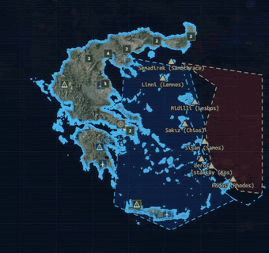
</p>

<p align="center"><sub><code>alpar-c2-greece-theatre-focus-airfield-august2026.gif</code> — looping capture: exclusive theatre-focus over a Greek / Aegean sector (island tracks, radar / early-warning coverage rings) drilling down to a single tracked air installation at satellite resolution</sub></p>

> **Recording note:** Delivered as a **looping GIF** (no audio), consistent with the other recordings in this README. The clip illustrates the **theatre-focus drill-down interaction** only — exact installation identity, coordinates, and detection-range parameters are not asserted by this figure and remain generalized in the surrounding text.

#### Public-camera network — theatre density & inline live preview

The **public OSINT camera layer** first introduced in July (documented catalogue, verify-before-seed policy, approximate FOV wedges) reached meaningful operational **density** in a covered coastal sector during August, alongside a new **inline live-preview** interaction pattern.

| Capability | Detail |
| :--- | :--- |
| **Catalogue density** | The verified public-camera catalogue for the focused coastal sector now surfaces a substantially denser marker set than the July snapshot — every marker still backed by a citeable public source page under the standing **verify-before-seed** policy; no fabricated or unverified feeds are added to close coverage gaps. |
| **Inline live-preview inset** | Selecting a camera marker opens a compact **live-feed viewer** directly on the tactical map — snapshot or HLS stream, depending on the source — without navigating away from the operator's current map context, for rapid visual cross-check against other sensing layers. |
| **Dense-cluster marker handling** | Closely-spaced camera groups in tight coastal segments render with viewport-aware layout so overlapping markers stay individually selectable at interactive zoom levels rather than collapsing into an unusable stack. |

<p align="center">
  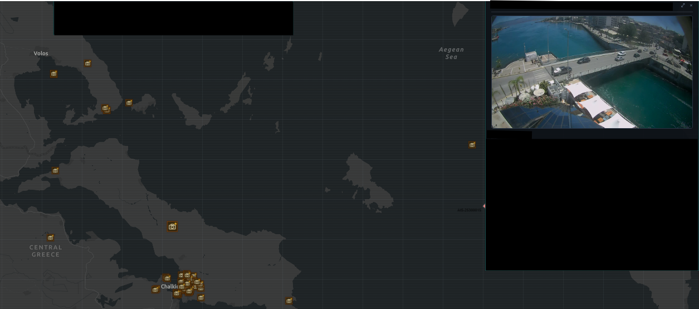
</p>

<p align="center"><sub><code>alpar-c2-public-camera-network-theatre-density-august2026.png</code> — verified public-camera catalogue over a coastal theatre sector · inline live-preview inset (representative harbour source) · dark tactical basemap</sub></p>

> **Public-repo note:** Exact camera counts, source URLs, and per-site attribution are withheld. This figure illustrates catalogue density and the live-preview interaction pattern only — it is not a claim about the operational status of any specific installation.

#### Security & defense news intelligence — multi-source aggregation & cross-verification

August also matured the **open-source news intelligence panel**, which sits alongside the geospatial map views and closes the loop between "what sensors observe" and "what is being reported." It ingests security/defense-relevant reporting from a broad set of open sources and turns an unstructured news stream into a triageable, filterable feed.

| Capability | Detail |
| :--- | :--- |
| **Multi-source aggregation** | Items are pulled continuously from a broad panel of open news sources and normalized into a single feed — headline, source domain, publication time, and outbound link — rather than requiring an operator to monitor each outlet individually. |
| **Automated relevance scoring** | Each item is scored on ingest so higher-relevance reporting surfaces first in a high-volume feed; the scoring model and its exact thresholds are withheld under the standing disclosure policy. |
| **Country-entity tagging & filter** | Items are automatically tagged with the country or countries they concern — a single report can reference more than one nation — and the panel exposes a multi-country filter so an operator can narrow the feed to a specific theatre of interest. |
| **Cross-source verification pass** | A corroboration pass — in the spirit of established open-source-investigation methodology — checks whether a claim is independently repeated across sources before it is weighted as higher-confidence, rather than trusting any single outlet at face value. |
| **Durable, replay-safe storage** | Ingested items are retained under a schema prepared specifically for this purpose; as with other schema work in this project, the migration is written and reviewed before being applied to any running database, never auto-applied on deploy. |

<p align="center">
  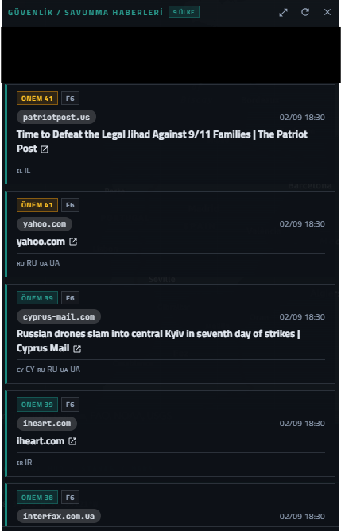
</p>

<p align="center"><sub><code>alpar-c2-security-defense-news-intelligence-august2026.png</code> — open-source news intelligence feed · automated relevance scoring · country-entity tagging and multi-country filter</sub></p>

> **Public-repo note:** Specific headlines, source outlets, exact relevance scores, and the precise set of monitored countries shown in this figure are illustrative of the interface only and are not an exhaustive or current list of sources or coverage.

#### Platform-integrity pass — silent-failure elimination

A structured audit was conducted across the **service layer, client layer, and data/configuration layer**, cataloguing behaviour that was **dormant, silently degraded, or brittle by construction** — code that appeared to function but quietly did less than advertised. Findings were graded by severity (does a real capability silently do nothing / return wrong data, or is it a hygiene gap) and worked through in a **phased, verified remediation pass**: every change was syntax- and type-checked, and re-exercised against live data before moving to the next item.

| Failure class | What was found | Remediation |
| :--- | :--- | :--- |
| **Geographic-bounds clipping** | A single, narrow default geographic filter — inherited by several unrelated subsystems (installation ingest, open conflict-event correlation, reconnaissance-orbit detection, landing correlation, signal-intercept and outage-correlation theatres) — silently dropped valid records at the edge of the operating theatre from live API responses, with no error surfaced anywhere. | The bound was independently re-derived and widened per affected subsystem on **both the service and client side**, with an explicit rationale recorded for each; a repeat of the same defect was subsequently found and closed in **the same subsystem family**, not only the first instance discovered. |
| **Position-derived identifier collision** | Several open-source catalogue loaders derived a record's secondary identifier from its **position in a source list** rather than from its content — meaning reordering or extending the source list could silently collide two unrelated records onto the same identifier. | Identifier derivation was moved to a **content-stable scheme** across every affected catalogue loader; the one loader where the identifier is a public-facing contract (referenced by an existing operator control) was instead changed to **fail loudly** if a new entry is added without an explicit mapping, rather than silently colliding. |
| **Silent exception swallowing** | Three subsystems — perimeter-breach correlation, cross-catalogue metadata fusion, and the executive KPI summary — caught their own query failures internally and returned an **empty, success-shaped result**, indistinguishable from "nothing to report." | Each subsystem now tracks its own last-failure state and surfaces an explicit **degraded** signal through its existing response contract (no new endpoints, no schema break) instead of a bare "ok" that could mean either "clear" or "broken." |
| **Dormant, keyless capability** | An open conflict-event correlation stream — sourced entirely from **no-key, public feeds** — was disabled by default, indistinguishable at the operator layer from a capability that had never been built. | Re-enabled by default; the one adjacent source in the same family that genuinely requires privileged access remains deliberately off. |
| **Schema governance gap** | Two production tables existed only through imperative, at-startup schema creation, with no formal migration history — unlike the rest of the schema. | Formal, idempotent migrations were authored for both and verified to resolve cleanly against the existing migration chain. Consistent with the platform's standing policy of **not applying schema changes without an explicit, separate review step**, these migrations were authored but intentionally **left unapplied** pending that review. |
| **Configuration discoverability** | Roughly **seventeen** subsystem-level configuration switches existed in code with no corresponding entry in the public configuration template, making several already-working capabilities undiscoverable without reading source. | Documented in the configuration template with a short description and, where relevant, a note on credential requirements — most needed no credential at all. |

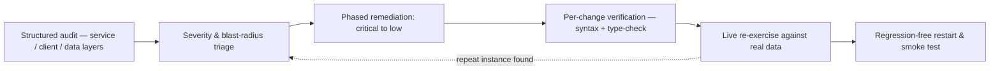
```mermaid
flowchart LR
  A[Structured audit — service / client / data layers] --> B[Severity & blast-radius triage]
  B --> C[Phased remediation: critical to low]
  C --> D[Per-change verification — syntax + type-check]
  D --> E[Live re-exercise against real data]
  E --> F[Regression-free restart & smoke test]
  E -.repeat instance found.-> B
```

> **Public-repo note:** Country-level record counts, exact geographic bounds, internal module and table names, and per-source citations remain in the private environment. This section records research methodology and engineering process, not the underlying dataset or code.

---

### July 2026 — Multi-Domain C2 Operations, Performance & Public Sensing Layer

July concentrated on turning the ALPAR C2 map from a SAR/optical Target Hunt workstation into a **multi-domain situational picture** — while systematically reducing idle-map frame cost so the operator UI remains responsive under dense overlays.

The opening showcase above illustrates four artefacts only: **cooperative military air-track presentation**, **live AIS / GPS-enabled vessel tracking**, **thermal heat anomalies**, and **potential GPS / GNSS jamming awareness**. The subsections below inventory the **remaining operator-facing July deliverables** that were **not** depicted in those clips and figures. May–June SAR/optical Target Hunt engineering remains in the dedicated sections that follow; this July report does not restate detector training or MPC COG ingest detail.

> **Disclosure policy:** Exact proprietary data-product names, internal endpoint paths, weight filenames, affiliation rule sets, and theatre-specific identifiers are **withheld**. Capabilities are described at an architectural / operator-facing level suitable for a public repository.

#### Performance architecture (idle-map discipline)

| Theme | Public-safe outcome |
| :--- | :--- |
| **Slice stores & shallow bindings** | Dashboard state partitioned into domain stores (UI toggles, hunt, tracks, alerts, air picture, dark vessels, viewport, kinematics, logs). Map host bindings select only map-relevant slices so unrelated panel updates no longer rebuild the entire map tree. |
| **Graphics upsert** | Air tracks, maritime contacts, landings, events, dead-reckoning markers, and geofence geometries update **in place by stable identity** instead of full layer teardown on each poll. |
| **Animation discipline** | Status rings, ISR orbit markers, naval trip clocks, and playback scrubbers animate via **GPU / graphic mutation or CSS refs**, not high-frequency React commits on the map root. |
| **Binary tactical transport** | High-rate telemetry coalesces into a shared binary websocket bus; protobuf-class payloads decode in a **web worker** with transferable buffers; alerts share one socket rather than per-panel duplicates. |
| **Off-main-thread compute** | Satellite TLE / pass geometry evaluation runs in a dedicated worker so globe insets do not stall interaction. |
| **Visibility-gated polling** | Background polls pause when the document is hidden; smart poll helpers bound refresh to operator-visible work. |
| **Startup reliability** | Exclusive background loops are guarded against duplicate process hosts; heavy sync jobs are staggered and skipped when local caches remain fresh. |
| **Density control** | Large installation layers apply **viewport culling** and zoom-dependent clustering so inland/coastal clutter does not stall interaction. |
| **Log / list virtualization** | Operator log terminals and alert / hunt-history lists use ring buffers and windowed rendering for large event volumes. |

#### Operator shell & design system

| Capability | Detail |
| :--- | :--- |
| **Domain-grouped layers** | Map toggles reorganized into **Air / Sea / Land / Sensor–EW / Intelligence / Analysis** accordion groups with active-count badges. |
| **Angular symbology** | Soft bubble clusters replaced with **angular, standards-inspired frames** for dense track groups. |
| **Tactical design tokens** | Shared borders, typography, muted palette, and outline controls applied across HUD chrome. |
| **Collapsible rails** | Left/right rails host layers, port presets, diagnostics, decision support, alerts, and playback without permanently consuming map area. |
| **Tabbed detail dock** | Bottom-left dock hosts **Air picture / Mission / Landing** tabs without overlapping the ROI toolbar. |
| **Bottom tactical dock** | Mid-priority HUDs stack in a shared bottom strip rather than floating ad hoc panels. |
| **HUD accordion** | Mode chip and maritime density panel share a mutual-exclusive expand pattern to avoid left-column overcrowding. |
| **Clean-screen mode** | One-click chrome collapse for presentation / map-only review. |
| **Decision support** | Ranked threat / fused-detection / geofence-event surface for operator triage. |
| **Target intel dossier** | Selected-contact panel with classification cues, threat scoring, and short trajectory sparklines. |
| **SAR↔optical comparison** | Side-by-side hunt-result comparison surface for dual-mode campaign review. |
| **Kinetic / intercept aids** | Selected-target kinematics checks and intercept-geometry cues as planning aids (not weapons-control). |
| **PiP multi-viewport console** | Strategic ROI focus cards for simultaneous theatre windows. |
| **Interrupt HUDs** | Incoming mission, perimeter breach, and emergency overlays with focus-to-incident / fly-to lock. |
| **Situational chrome** | Playback bar, mini-map, kinematics HUD, altitude–speed strip chart, metadata widget, alert feed / toasts, naval sortie cues. |
| **Tactical draw tools** | MGRS-aware waypoints, search grids, and multi-node routes that can be packaged for mission relay. |
| **Port & mission menus** | Coastal port ROI presets and mission-action menus for rapid tasking. |
| **KPI summary** | Read-only executive summary surface for high-level operational counts. |

<p align="center">
  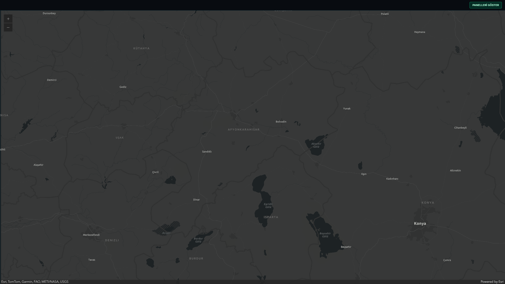
</p>

<p align="center"><sub><code>alpar-c2-july2026-map-layers.png</code> · <code>alpar-c2-july2026-clean-map.png</code> — map-first presentation mode with zone overlays on dark basemap (panel chrome collapsed)</sub></p>

#### Comparative air-track presentation — ALPAR C2 vs Flightradar24

The paired screen recordings below document how the **same class of cooperative military air contact** is rendered in two distinct operational contexts: (i) the private **ALPAR C2** multi-domain common operating picture, and (ii) a contemporaneous view on the public commercial service **Flightradar24**. The comparison is intended as a **human-factors / situational-awareness** illustration — not as a claim of equivalent data rights, coverage, or affiliation fidelity.

On the ALPAR side, the contact is presented inside a **tactical air picture** with domain-grouped layers, standards-inspired symbology, and operator chrome designed for C2 triage. On Flightradar24, the same period is shown through a **civil flight-awareness** map paradigm oriented toward public track browsing. Together, the clips highlight differences in visual density, symbology grammar, and operator framing when a military airframe is inspected under a purpose-built C2 shell versus a consumer flight tracker.

> **Recording note:** Clips are delivered as **looping GIFs** (no audio) so they play continuously in the README. Theatre identifiers, callsigns, and exact coordinates remain generalized in the surrounding documentation; the recordings are demonstration artefacts only.

<table>
  <tr>
    <td width="50%" valign="top">
      <p align="center"><strong>ALPAR C2 — Military aircraft track presentation</strong><br/>
      <sub>Private multi-domain C2 map · cooperative air picture · tactical symbology</sub></p>
      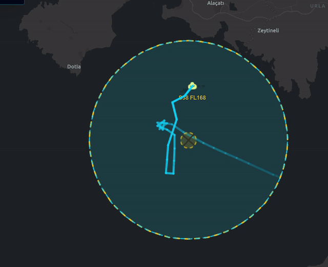
    </td>
    <td width="50%" valign="top">
      <p align="center"><strong>Flightradar24 — Military aircraft track presentation</strong><br/>
      <sub>Commercial public flight-awareness map · contemporaneous capture</sub></p>
      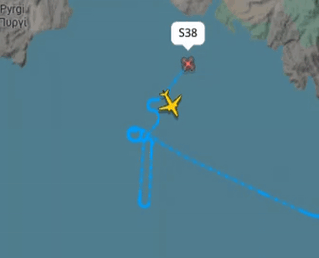
    </td>
  </tr>
</table>

<p align="center"><sub><code>docs/videos/alpar-c2-military-aircraft-track-july2026.gif</code> · <code>docs/videos/flightradar-military-aircraft-track-july2026.gif</code> — side-by-side looping demonstration GIFs (August 2026)</sub></p>

#### Air domain (beyond the showcase clip)

Cooperative air-track presentation is shown in the opening GIF comparison. July also shipped the supporting air-picture tooling below.

| Capability | Detail |
| :--- | :--- |
| **Dead reckoning** | Short-horizon kinematic extrapolation (course / speed) so tracks remain visually continuous between telemetry updates. |
| **Altitude trail ribbons** | Time-windowed altitude-styled track segments with segment tooltips for selected or filtered contacts. |
| **Altitude / speed strip** | Selected air-track time series in the operator HUD for rapid vertical / energy awareness. |
| **GPU-instanced symbology** | Optional WebGL2 path for dense air/sea military symbols at interactive frame rates, kept off the React commit hot path. |
| **ISR orbit footprints** | Planned / active reconnaissance loiter orbits with lightweight GPU-safe animated markers (distinct from satellite overpass). |
| **Approach / landing cues** | Correlation of air tracks against coastal / air installations for approach and touchdown situational awareness, with a dedicated landing tab in the detail dock. |

#### Live maritime tracking of GPS / AIS-enabled vessels

ALPAR C2 maintains a **cooperative maritime surface picture** for vessels that broadcast identity and kinematics through public Automatic Identification System (AIS) channels — i.e. ships whose navigational reporting (commonly described as “GPS / AIS on”) is visible to open collectors. The layer is intended for **live coastal and open-water traffic awareness**: contact symbols, short labels, and speed cues update as fresh reports arrive, so the operator can follow cooperative traffic without waiting for a SAR or optical Target Hunt cycle.

Visually, contacts are differentiated by affiliation-inspired marker geometry on a dark bathymetric / maritime basemap, with optional kinematic annotations (for example reported speed in knots). This cooperative AIS layer complements **non-cooperative / dark-track** highlighting and MDA density overlays described below: open reporters populate the live traffic mesh, while dark-vessel logic flags absences or inconsistencies relative to other sensing modes. Exact feed endpoints, MMSI catalogues, and theatre filters remain private; the figure below illustrates the **operator-facing live track presentation** only.

<p align="center">
  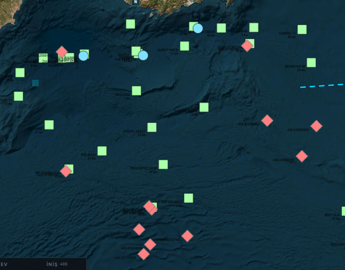
</p>

<p align="center"><sub><code>alpar-c2-live-ais-vessel-tracking-july2026.png</code> — live cooperative AIS contacts · identity / speed cues · dark maritime basemap · Sea-domain surface picture</sub></p>

#### Maritime domain (beyond the live AIS figure)

Live GPS / AIS-enabled vessel tracking is illustrated above. The July maritime stack also includes non-cooperative and undersea context layers.

| Capability | Detail |
| :--- | :--- |
| **Flagged naval / C4ISR contacts** | Dedicated naval-contact overlay for catalogue-flagged military and dual-use surface tracks (alongside general cooperative AIS). |
| **MDA density & dark tracks** | Traffic-density aggregation with non-cooperative / dark-track highlighting for coastal theatres. |
| **Ship–detection correlation overlay** | Map markers distinguishing cooperative-verified versus dark / unmatched hunt correlations with operator popup cards. |
| **Route-history trips** | Short-horizon naval route history rendered via a ref-clock animation loop (no per-frame React re-renders), with acknowledgeable sortie alert toasts. |
| **NAVTEX advisory zones** | Maritime safety / advisory polygons for operator context. |
| **Subsea infrastructure** | Cable and pipeline corridor awareness with threat-flash cues when relevant events intersect corridors. |
| **ASW bathymetry & acoustic HUD** | Isobath / clearance-style undersea context plus point acoustic-zone and draft-risk readouts for selected locations. |
| **Search & drift uncertainty** | IAMSAR-style drift / search uncertainty envelopes assisted by live metocean inputs where available. |
| **Shipboard sensor gateway** | Optional NMEA / STANAG-class ingest path with built-in-test style operator HUD (capability existence only; no deployment topology published). |

#### Land & installations

| Capability | Detail |
| :--- | :--- |
| **Military / dual-use bases** | OSINT-backed coastal, air, and radar installation overlays with viewport culling and clustering. |
| **Barracks / garrisons** | Land garrison and training-site point layers. |
| **Radar coverage rings** | Theoretical coverage rings for operator planning (not measured RF surveys). |

#### Thermal heat anomaly detection on the C2 map

Beyond cooperative air tracks, ALPAR C2 ingests **satellite-derived thermal anomaly** products and renders them as an operator-toggleable sensing layer. The figure below shows a representative theatre extract in which discrete heat signatures appear as luminous point markers with soft radial halos on the dark tactical basemap — a visual encoding chosen for rapid detection of clustered thermal events against cluttered terrain and road networks.

The underlying inputs are drawn from **public Earth-observation / open geospatial programmes** (including NASA-family thermal anomaly feeds where licensing permits). On the map they support multi-domain situational awareness alongside EW interference heat, hunt detection density, and other analysis overlays described below. Exact product SKUs, refresh cadences, and theatre-specific filtering rules remain in the private environment; this README records the **operator-facing presentation** only.

<p align="center">
  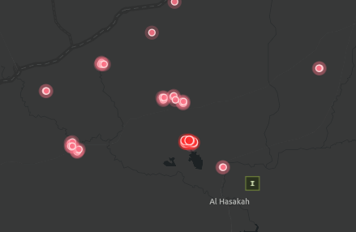
</p>

<p align="center"><sub><code>alpar-c2-thermal-heat-anomalies-july2026.png</code> — thermal / heat-anomaly layer · clustered IR signatures · dark Esri-style tactical basemap · Sensor–EW domain toggle</sub></p>

#### Potential GPS / GNSS jamming awareness

Reliable positioning is a prerequisite for both civil aviation awareness and tactical multi-domain fusion. Open flight-awareness monitors periodically publish **suspected GPS / GNSS interference** footprints — typically rendered as translucent polygons or dashed containment rings over coastal corridors where cooperative tracks exhibit anomalous navigation behaviour (for example sudden position jumps, loss of integrity cues, or corridor-scale outages).

The figure below is a representative capture of such a **potential jamming / denial zone** over a Black Sea coastal theatre. The shaded polygon and nested dashed ring encode a spatial hypothesis of degraded satellite navigation rather than a confirmed emitter geolocation. In ALPAR C2, the analogous operator need is addressed by the **EW / GNSS interference heat** overlays in the Sensor–EW domain: interference-style fields are fused into the common operating picture so air and maritime tracks can be interpreted with navigation-integrity context. Exact emitter attribution, classified EW product names, and internal confidence models are withheld; this README records the **situational-awareness framing** only.

<p align="center">
  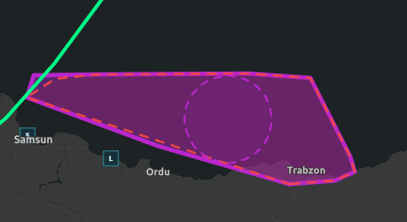
</p>

<p align="center"><sub><code>potential-gps-gnss-jamming-zone-july2026.png</code> — suspected GPS / GNSS interference footprint · polygonal denial cue · coastal theatre · EW-awareness context for ALPAR C2</sub></p>

#### Sensor, EW & hybrid awareness (beyond thermal & jamming figures)

July also wired the adjacent Sensor–EW surfaces below.

| Capability | Detail |
| :--- | :--- |
| **Emergency comm + open radio** | Emergency squawk-class cues with optional linked public WebSDR-style audio surfaces for operator cross-check. |
| **Cyber / hybrid outages** | Outage and hybrid-threat markers for multi-domain context. |
| **Cross-domain hybrid alerts** | Operator interrupt when cyber-outage and interference-style cues correlate in space–time (indication only; not attribution). |

#### Intelligence, perimeter & mission workflow

| Capability | Detail |
| :--- | :--- |
| **Open event overlays** | Flag-gated conflict / hazard / regional military-event layers drawn from public open-data feeds. |
| **Perimeter geofence** | Operator-defined geofences with critical breach banners, toasts, and focus-to-incident actions across coastal, advisory, and installation perimeters. |
| **Mission packages & relay HUD** | Waypoint / route / SAR-task packages with relay intent toward peer C2 consumers and a pulsing incoming-mission card with map fly-to lock. |
| **Satellite overpass planning** | Pass windows and swath / footprint cues for acquisition planning. |
| **Next-acquisition countdown** | ROI-scoped next-pass estimate for common open EO collections, with operator countdown UI. |
| **CoT-aligned lifecycle** | Cursor-on-Target-style stale lifecycle (active → stale → lost / purge) plus emergency overlays for shared common operating picture hygiene. |
| **Destination prediction** | Likely next-port / route cues as a planning aid (capability mention only). |
| **Interop export hooks** | STANAG-class and related interop export paths at the service boundary (schemas and credentials remain private). |

#### Analysis overlays

| Capability | Detail |
| :--- | :--- |
| **Threat density heat** | Aggregated threat-density visualization on the C2 map. |
| **Hunt detection density** | Spatial density of SAR / optical Target Hunt detections for campaign review. |
| **Radar blind sectors** | DEM viewshed-derived blind-sector cues for coverage planning. |

#### Public OSINT camera sensing layer

| Theme | Public-safe outcome |
| :--- | :--- |
| **Documented catalogue only** | Intelligence toggle for **public traffic / tourism / port webcams**. Only streams with a citeable source page and a live-verified HLS or snapshot URL are catalogued — no fabricated feeds. |
| **Approximate FOV wedges** | Camera markers may show approximate field-of-view cones for spatial orientation (geometry is indicative, not a survey product). |
| **Empty-state honesty** | Empty catalogues surface an explicit operator notice rather than a silent blank layer. |
| **Coverage-gap reporting** | Administrative coverage reports distinguish **verified streams** from **regions with zero public sources** (a data gap, not a software defect). |
| **Theatre expansion** | Ongoing verify-before-seed expansion across coastal theatres remains **in progress** on the private branch. |

#### 3D / space & AMD insets

| Capability | Detail |
| :--- | :--- |
| **Space-domain TLE inset** | Optional code-split globe / TLE panel with AOS / TCA / LOS-style pass cues; off the hot path until explicitly opened. |
| **AMD / engagement inset** | Optional 3D air-and-missile-defence style engagement globe (mutual exclusion with the space inset to protect GPU budget). |

#### Supporting catalogues & planning aids

| Theme | Public-safe outcome |
| :--- | :--- |
| **Naval port presets** | Regional naval / dual-use port ROI presets classified at OWN / FOREIGN level for rapid map focus (berth-scale coordinate lists are not published here). |
| **Strategic ROI presets** | Named theatre focus cards (for example coastal chokepoints and major naval approaches) without publishing coordinates in this repository. |
| **Acquisition planner** | Next-acquisition box cues for SAR revisit planning after Target Hunt sessions. |
| **Correlation & decoy hygiene** | Ship-correlation classes, kinetic validation, and decoy / false-positive suppression remain available beside Mod 1–3 hunt workflows (see June sections for detection detail). |

#### Engineering hygiene

- Removed orphaned dual air-layer paths that previously double-drew tracks.
- Reduced logging noise from high-frequency telemetry relays.
- Virtualized alert and hunt-history lists for large event volumes.
- Coverage reporting for the public-camera catalogue distinguishes verified streams from administrative regions with zero public sources.
- Performance backlog items (for example long-task proof on decode workers) tracked privately; public README records shipped outcomes only.

> **Public-repo note:** Stream catalogues, geofence geometries, affiliation rules, heat-product configurations, MMSI / installation lists, and binary schema details remain in the private environment. This README records capability existence and operator UX intent only.

---

### Late June 2026 — C2 Stability, Detection Performance & Live SAR Validation

Follow-up engineering sprint on the private **ALPAR C2** stack after the June MPC COG release. Focus: **production-grade reliability** of Mod 1 SAR and Mod 2 Optical Target Hunt, **sub-pixel overlay fidelity**, and **operator-facing detection quality** — without expanding the public attack surface or publishing deployment credentials.

<p align="center">
  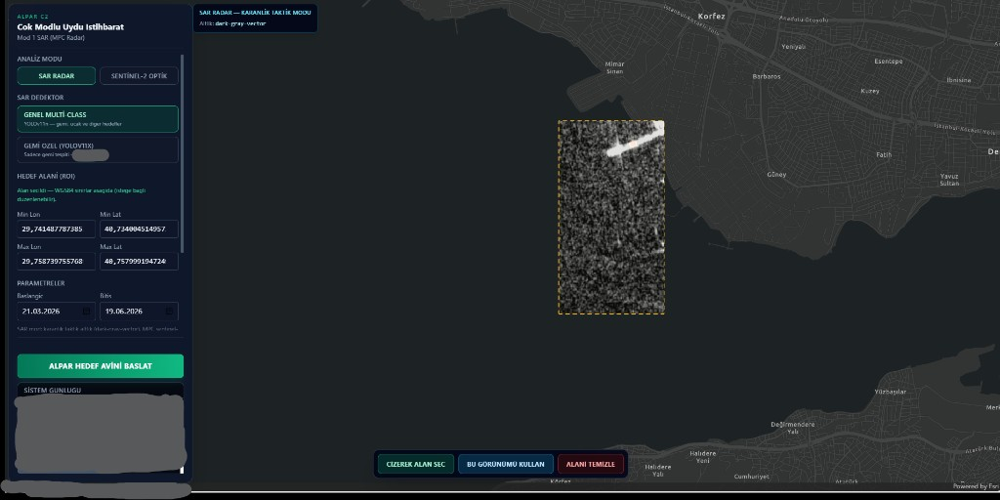
</p>

<p align="center"><sub><code>alpar-c2-sar-general-yolo-mpc-overlay-june2026.png</code> — **Mod 1 SAR Radar** · YOLOv11n multi-class head · MPC <code>sentinel-1-grd</code> COG window overlay · dark tactical Esri basemap · ROI-scoped hunt · live SSE operator log</sub></p>

#### Mod 1 SAR — dual-detector routing & COG georeferencing

| Capability | Detail |
| :--- | :--- |
| **Dual SAR detector selector** | Operator chooses **General Multi-Class** (YOLOv11n — ship, aircraft, harbor, …) or **Ship-Focused** (YOLOv11x maritime add-on) from the C2 panel; API mode routing: `sar` \| `sar-ship`. |
| **MPC COG window streaming** | Sentinel-1 GRD VV chips read via **rasterio** ROI windows — no full granule download. |
| **GCP / hull-safe reads** | SAR chips materialized through **GDAL WarpedVRT** so MPC COG assets with GCP georeferencing remain readable without boundless-read failures. |
| **Overlay ↔ ROI alignment** | Map PNG extent derived from the **actual raster window affine** and synchronized with the operator-drawn ROI — eliminates visible drift between drawn box and displayed SAR chip. |
| **Swath footprint filter** | STAC candidates pre-filtered: ROI centre must fall inside the Sentinel-1 item geometry (reduces false scene picks from loose bbox search). |
| **Harbor-scale ROI guard** | Maximum ROI span enforced (~1°) so COG windows and YOLO chips stay at maritime / port analysis scale. |

#### Mod 2 Optical — YOLO performance & map product

| Capability | Detail |
| :--- | :--- |
| **YOLO as default path** | Optical processing defaults to **YOLO Target Hunt** (manual stretch-only preview remains available). |
| **Dual radiometry pipeline** | **Per-band 2–98% stretch** for analyst map overlay; **linked percentile stretch** for YOLO inference (better colour fidelity → improved recall on small ships). |
| **Detection-aware overlay** | When YOLO finds targets, the map layer switches to an **annotated RGB overlay** (bounding boxes on the georeferenced PNG). |
| **Tuned inference defaults** | Higher-resolution chip export (**2048 px**), lower confidence floor (**≈0.12**), two-stage predict/filter (broad candidate sweep → operator threshold), optional test-time augmentation. |
| **Multi-class optical head** | Detects `aircraft`, `bridge`, `car`, `harbor`, `ship` on MPC Sentinel-2 L2A / Landsat C2 L2 COG windows. |
| **Empty-result UX** | No detections returns a **successful preview** with clean overlay on map (not a hard error) — analyst can still visually inspect the scene. |

#### MPC STAC resilience & API hygiene

| Issue class | Mitigation |
| :--- | :--- |
| **STAC server timeouts** | Wide datetime queries split into **newest-first 30-day windows** with **exponential backoff retries** on transient MPC errors. |
| **Query load** | SAR scene queue capped (**≤12 scenes** per hunt) to stay within public catalogue latency budgets. |
| **Fresh catalogue bias** | Hunt date ranges clamped to **today UTC**; STAC `sortby=-datetime` ensures newest granules are tried first. |
| **Request validation** | Frontend/API `max_scenes` limits aligned — prevents silent **422** rejections before hunt start. |
| **Import / startup stability** | Ingestion services hardened (missing symbol fixes on MPC SAR/optical paths). |

#### Codebase slimming (private branch)

Legacy paths removed from the active Target Hunt server surface to reduce cold-start weight and operator confusion:

- Retired **NASA ASF ZIP** download loop from the primary hunt path (MPC COG is canonical).
- Removed unused **legacy CNN tactical detector** startup hooks from the API process.
- Pruned stale static overlay artefacts; kept **Fusion Engine** and verification scripts as optional Mod 3 layer.

> **Public-repo note:** Weights, `.env` secrets, internal storage identifiers, and Entra application IDs are **not** documented here. All cloud writes remain **deployment-gated**; development builds use **read-only MPC ingest** and **local static overlays**.

---

### 13 June 2026 — SAR Ship-Only YOLOv11x Add-On Module

ALPAR **Mod 1** runs a **dual-detector SAR stack**: the existing **YOLOv11n multi-class** model remains in service for general-purpose SAR Target Hunt (aircraft, vehicles, harbor, ship, and related classes). On **13 June 2026**, a **ship-only YOLOv11x** module was added as a **maritime specialist add-on** — tuned to separate **ship radar returns** from **sea clutter** and **coastal structure** in Sentinel-1 GRD chips when operators need maximum sensitivity on waterborne targets.

> **Architecture note:** YOLOv11x does **not** retire YOLOv11n. Both weights coexist on the private branch; routing selects the general multi-class head or the ship-only head according to mission profile.

#### Model architecture

| Property | Value |
| :--- | :--- |
| **Framework** | Ultralytics **YOLOv11x** (Extra Large) |
| **Parameters** | **56.8 M** |
| **Task** | Single class — `ship` only |
| **Rationale** | Heavy backbone capacity for speckle-heavy SAR: small bright returns on dark water, land–sea boundary false alarms, and variable ship RCS |

#### Training corpus

<p align="center">
  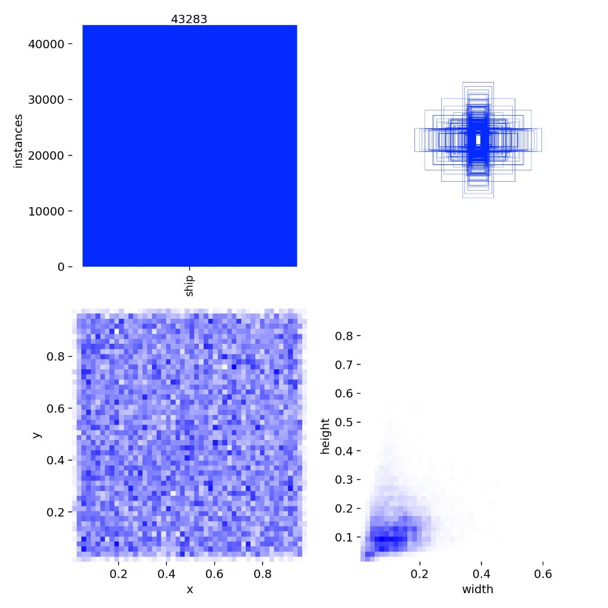
</p>

<p align="center"><sub><code>alpar-sar-ship-dataset-labels-analysis.png</code> — **43,283** annotated ship instances · uniform spatial coverage · predominantly small normalized box footprints (typical maritime chip scale)</sub></p>

#### Infrastructure bottleneck & resolution

Initial training on **standard Colab GPU tiers** with a **tens-of-thousands-image SAR corpus (~37.5 GB on disk)** hit hard limits:

| Symptom | Root cause |
| :--- | :--- |
| **Extremely long epochs / session freezes** | Disk **I/O thrashing** — repeated random reads from storage |
| **Out-of-Memory (OOM) crashes** | Insufficient **system RAM** for dataloader workers + augmentation buffers |
| **Unstable throughput** | Small VRAM forcing conservative batch sizes on YOLOv11x |

**Mitigation (Google Colab Pro — high-memory runtime):**

| Resource | Specification | Effect |
| :--- | :--- | :--- |
| **GPU** | **NVIDIA A100 · 80 GB VRAM** | YOLOv11x at **`batch=64`** without VRAM exhaustion |
| **System RAM** | **167.1 GB** | Full dataset residency via **`cache=True`** (~37.5 GB pinned in memory) |
| **Disk I/O** | Eliminated from hot path | Epoch wall-clock dropped to **~9.5 min** (vs. multi-hour stalls on prior tier) |

> **Engineering takeaway:** For large SAR chip corpora, **RAM-cached training** on A100-class hardware was the decisive fix — not a larger epoch budget on under-provisioned nodes.

#### Validation metrics — epoch 18 (early stop)

Training was **manually terminated at epoch 18**. Validation curves had entered a **performance plateau**: mAP50, Recall, and mAP50-95 showed diminishing returns while train/val loss separation remained stable — continuing risked **overfitting** without meaningful generalization gain.

| Metric (epoch 18) | Score | Notes |
| :--- | :---: | :--- |
| **Precision** | **92.73%** | Low false-alarm rate on held-out SAR chips |
| **Recall (Sensitivity)** | **92.71%** | Strong capture of ship returns in clutter |
| **mAP50** | **96.81%** | IoU ≥ 0.50 |
| **mAP50-95** | **63.29%** | IoU 0.50–0.95 band — tight box regression on small targets |

Loss at epoch 18: train box **1.269** · cls **0.683** · dfl **1.336** — val box **1.203** · cls **0.546** · dfl **1.379** (no divergence spike).

**Decision:** Ship-only YOLOv11x weights at **epoch 18** exported as the **maritime specialist add-on** for ALPAR Mod 1 — deployed alongside the existing YOLOv11n multi-class detector. Weights and training artefacts remain in the private environment.

#### Dual-head integration (13.06.2026)

- **YOLOv11n (multi-class)** — primary Mod 1 SAR detector; metrics in [YOLOv11n Multi-Class](#model-training-and-evaluation-metrics-sar-subsystem--yolov11n-multi-class) (below).
- **YOLOv11x (ship-only)** — maritime add-on; singleton model registry loads both heads.
- **Routing:** general SAR sweep → YOLOv11n · ship-focused maritime ROI → YOLOv11x.
- **Pipeline:** MPC SAR COG window → radiometry → selected YOLO head → georeferenced overlay + dual-panel report.

---

### June 2026 — MPC COG Streaming, Esri C2 & Local-First Trial Mode

- **Unified COG ingestion:** Mod 1 (`sentinel-1-grd`) and Mod 2 (`sentinel-2-l2a`, Landsat C2 L2) use **rasterio window reads** from Planetary Computer — ROI-scoped, seconds-level latency profile.
- **Esri MapView frontend:** Replaced Leaflet map core with **@arcgis/core MapView**; SAR/optical **basemap auto-switch**; georeferenced transparent PNG overlay with **live opacity slider**.
- **Optical two-phase UX:** STAC scene listing for the drawn ROI, then per-scene **manual** (visual inspection) or **YOLO** processing.
- **Radiometric transparency:** Optical overlays use **per-band 2–98% stretch** without cloud or water masking — suitable for analyst visual QA.
- **Sub-pixel georef:** Overlay extent computed from raster window transform; API returns full-precision WGS84 bounds to the map client.
- **Trial cloud-write policy:** Development deployments can enforce **read-only cloud access** — no remote catalog push or blob upload; overlays remain on local static media only.

### Foundation work (May – early June 2026)

Delivered in the first ~3 weeks after kick-off: cloud data-plane modularization, Azure integration outcomes, SAR detector upgrades, the **ALPAR C2 multi-mode Target Hunt** stack, and the **Mod 3 GeoCatalog Fusion Engine**.

### Mod 3 Intelligence Fusion Layer — Azure GeoCatalog (Production)

- **Azure GeoCatalog Integration:** Successfully deployed as the multi-modal data fusion and cataloging core for **Mode 3 (Intelligence Fusion Layer)**.
- **Isolated architecture:** Mod 1/2 MPC COG Target Hunt ingestion paths are unchanged; GeoCatalog consumes detection metadata only.
- **`POST /api/v1/analytics/fusion-window`:** Builds a unified Fusion Window from SAR + Optical detections, STAC catalog items, and acquisition metadata.
- **Pydantic-configured deployment:** `MPC_PRO_GEOCATALOG_URL`, `AZURE_GEOCATALOG_NAME`, `AZURE_SUBSCRIPTION_ID`, `AZURE_RESOURCE_GROUP`, `AZURE_CLIENT_ID`.
- **Verification script:** `python scripts/verify_geocatalog.py` (private branch).

### ALPAR C2 Dashboard & Mode-Aware Target Hunt

- **Interactive C2 frontend** (Next.js + **Esri MapView**): map-based ROI drawing, live SSE operation log, dual-panel result modal, and georeferenced overlay layer.
- **Mode routing (`sar` | `sar-ship` | `optical`)**: Strategy-pattern dispatch isolates ingestion, model weights, confidence defaults, and output directories per sensor stream and SAR detector head.
- **Mod 1 SAR Target Hunt**: MPC `sentinel-1-grd` COG window stream within ROI/time window; YOLO loop; georeferenced local overlay + dual-panel report.
- **Mod 2 Optical Target Hunt**: MPC optical COG window stream with satellite dropdown; **manual** or **YOLO** path; WGS84 detection mapping when inference runs.
- **Singleton YOLO model cache**: Per-mode weights loaded once and reused across API requests.
- **REST + SSE endpoints**: Synchronous JSON response and streaming log channel for operator-facing dashboards.

### YOLO11s + SAHI High-Resolution Optical Subsystem (Production-Ready)

- **Dataset Harmonization:** Compiled a training corpus of **80,020 images** with **400,000+ annotations** from DOTA and DIOR datasets.
- **Sanitized Classes:** Filtered 30+ non-tactical classes and dynamically resolved malformed annotations. Sorted and locked class IDs alphabetically (`0: aircraft`, `1: bridge`, `2: car`, `3: harbor`, `4: ship`) to match downstream fusion modules.
- **Training Resilience:** Successfully recovered and resumed training on the NVIDIA L4 GPU platform with zero epoch loss after connection drops using Google Drive checkpoint sync. Verified weight optimization outcomes where inference weight size was stripped to exactly **18.4 MB** (from 54.3 MB checkpoint).
- **SAHI Integration:** Implemented 256x256 sliding window inference with 25% overlap, boosting baseline raw Recall from 54.22% to **75% - 80%** operational Recall, resolving small-target detection challenges in dense airfield and port layouts.

### Azure GeoCatalog Integration — Mod 3 Intelligence Fusion Layer

**Azure GeoCatalog Integration: Successfully deployed and utilized as the multi-modal data fusion and cataloging core for Mode 3 (Intelligence Fusion Layer).**

Microsoft **Planetary Computer Pro GeoCatalog** is now the upper intelligence tier of the ALPAR stack. It does **not** replace Mod 1/2 MPC COG Target Hunt ingest. Instead, it:

- **Catalogs** STAC metadata (acquisition time, collection, platform, asset keys) for the operator-selected ROI via authenticated Entra ID access.
- **Correlates** SAR and Optical target-hunt detections by geospatial proximity and temporal context.
- **Publishes** a unified **Fusion Window** JSON payload to the frontend via `POST /api/v1/analytics/fusion-window`.

| Layer | Role | Ingestion source (unchanged) |
| :--- | :--- | :--- |
| **Mod 1** | SAR Target Hunt + YOLO | MPC `sentinel-1-grd` COG (primary) |
| **Mod 2** | Optical Target Hunt + YOLO / manual QA | MPC `sentinel-2-l2a` & Landsat C2 L2 COG |
| **Mod 3** | GeoCatalog STAC catalog + detection metadata fusion | Cloud metadata plane (deployment-gated) |

Configuration is managed through **Pydantic Settings** in the private deployment. Credentials, subscription identifiers, and deployment secrets remain in the private environment only.

### Modular Runtime Modes (A / B / C — data plane)

| Mode | Designation | Data plane (summary) |
|------|-------------|----------------------|
| **A** | Fast / catalogue | **Primary Target Hunt path** — MPC STAC + COG window reads (SAR & optical) |
| **B** | Enterprise / storage | Sentinel-1 VV/VH COG from **Azure Blob Storage**, windowed 512×512 reads (primary operational path) |
| **C** | Legacy SAR ingest | Optional GeoCatalog-backed SAR I/Q reads (`ALPAR_GEOCATALOG_SAR_INGEST`, disabled by default) |

> **Mod 3 Fusion** is orthogonal to run modes A/B/C. GeoCatalog serves the fusion API regardless of whether blob, catalogue, or mock SAR loaders are active.

### Azure Blob Storage Integration (Mod B)

- Container layout for **SAR COG**, optional optical GeoTIFFs, and **tactical PNG** outputs.
- **Windowed COG reads** to minimize bandwidth.
- API responses may include **`tactical_map_blob_url`** when storage is configured.
- **Pydantic Settings**–based configuration for run mode, containers, paths, and timeouts.

### Mod 3 Fusion Engine (GeoCatalog — Production)

- **`POST /api/v1/analytics/fusion-window`**: merges Mod 1 SAR and Mod 2 Optical detection payloads inside a shared ROI.
- **GeoCatalog STAC search**: retrieves catalog items intersecting the fusion bbox; enriches detections with acquisition metadata.
- **Spatial decision fusion**: pairs SAR/Optical hits within a configurable match radius; labels results as `fusion_verified`, `sar_only`, or `optical_only`.
- **Health probe**: `/health` reports `fusion_layer` and GeoCatalog reachability without exposing credentials.
- **Isolation guarantee**: Target Hunt `mode=sar|optical` routing and ingestion services are unchanged.

### Offline / Zero-Network Operation

- Local **`mock_s1.tif`** (VV/VH-style GeoTIFF) for SAR I/Q without network calls.
- Synthetic optical RGB from mock when **offline-only** mode is enabled.
- No blob upload, catalogue access, or third-party tile servers in that mode.

### Configuration & API Hardening

- Structured JSON with fusion provenance (scene id, source, processing level).
- **Fail-fast** ingestion—no silent synthetic substitutes on production paths.

---

---


## Engineering Release Report — June 2026 (Private Branch Summary)

This section documents the **first major validated engineering cycle** on the private ALPAR stack (project kick-off **~May 2026**): unified **Cloud-Optimized GeoTIFF (COG) streaming** for both SAR and optical Target Hunt modes, an **Esri-native C2 map frontend**, sub-pixel **WGS84 overlay alignment**, and a **local-first trial policy** that avoids remote catalog writes during development.

### Executive summary

| Area | Earlier approach (same build window) | Current validated behaviour (private branch) |
| :--- | :--- | :--- |
| **Mod 1 SAR ingest** | NASA ASF granule search & download | **Microsoft Planetary Computer** `sentinel-1-grd` STAC + **rasterio window read** (ROI pixels only) |
| **Mod 2 Optical ingest** | Third-party map imagery export for ROI | **MPC STAC** — `sentinel-2-l2a` or **Landsat Collection 2 L2** with operator-selectable satellite dropdown |
| **Data transfer model** | Full-frame or export API pulls | **COG HTTP range reads** into RAM — no whole-scene download required for hunt |
| **C2 frontend** | Leaflet-based ROI dashboard | **Next.js + Esri ArcGIS MapView** — tactical basemap auto-switch, georeferenced overlay, opacity control |
| **Overlay georef** | Bounding-box approximation | Extent derived from **rasterio window affine** — full floating-point WGS84 returned to the map layer |
| **Optical visualization** | Standard inference frame | Per-band **2nd–98th percentile contrast stretch** on raw multispectral COG bands (no cloud masking) |
| **Trial / dev policy** | Remote catalog & blob staging enabled when configured | **Configurable cloud-write gate** — local PNG overlays only; remote STAC push and blob upload bypassed |

> **Security & operations note:** Deployment credentials, storage account identifiers, Entra application IDs, internal collection names, and weight artefacts are **not** published here. Operators configure authentication and cloud policies only in the private environment.

### COG streaming architecture (Mod 1 + Mod 2)

<p align="center">
  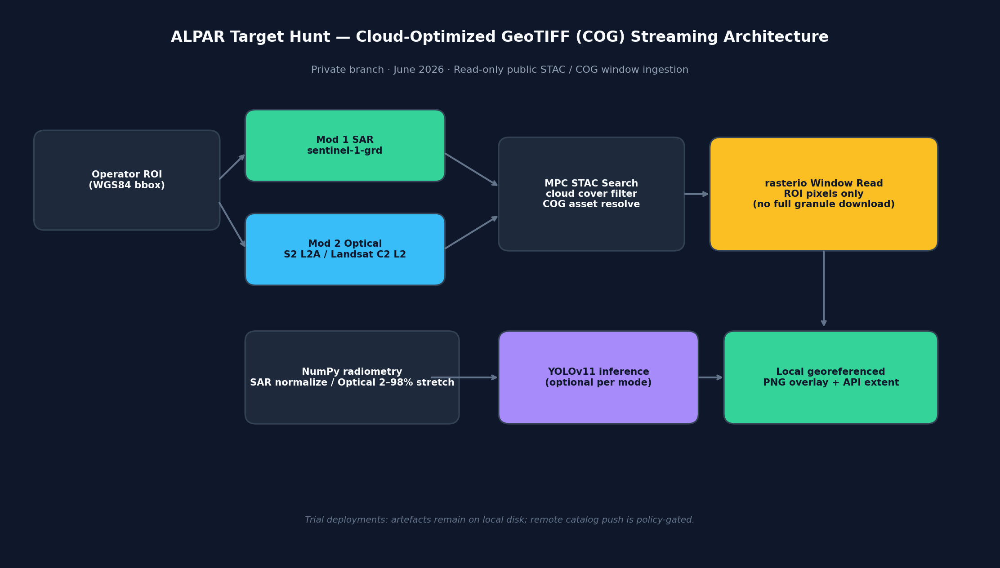
</p>

<p align="center"><sub><code>alpar-mpc-cog-streaming-architecture.png</code> — unified read-only ingestion: STAC discovery → signed COG asset → rasterio ROI window → radiometry → optional YOLO → local georeferenced overlay</sub></p>

**Technical highlights (public-safe):**

- **STAC-first discovery** on the public Planetary Computer catalogue with **cloud-cover filtering** for optical collections.
- **Band mapping by sensor:** Sentinel-2 true-colour (red / green / blue COG assets); Landsat C2 L2 equivalent RGB assets — selected from the optical dropdown.
- **Windowed COG reads** via `rasterio` — only the operator ROI is materialized in memory.
- **SAR radiometry** normalizes GRD backscatter for visual overlay; **optical radiometry** applies per-band percentile stretch so clouds and open water remain visually interpretable without semantic masking.
- **Singleton YOLO registry** unchanged — one weights load per sensor mode per API process.

### Ingestion paradigm shift (optical)

<p align="center">
  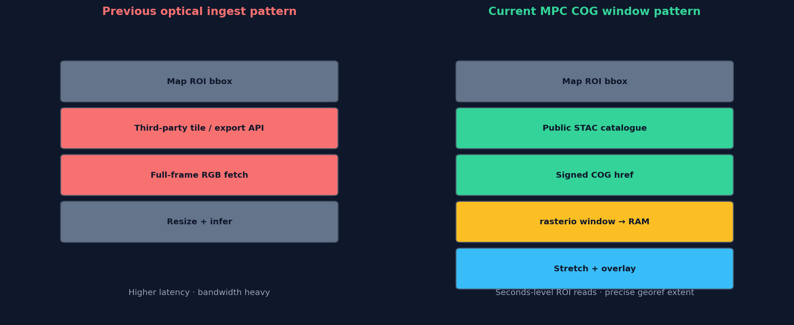
</p>

<p align="center"><sub><code>alpar-ingestion-paradigm-comparison.png</code> — conceptual comparison: full-frame export latency vs ROI-scoped COG streaming</sub></p>

### C2 dashboard — Esri MapView workflow

<p align="center">
  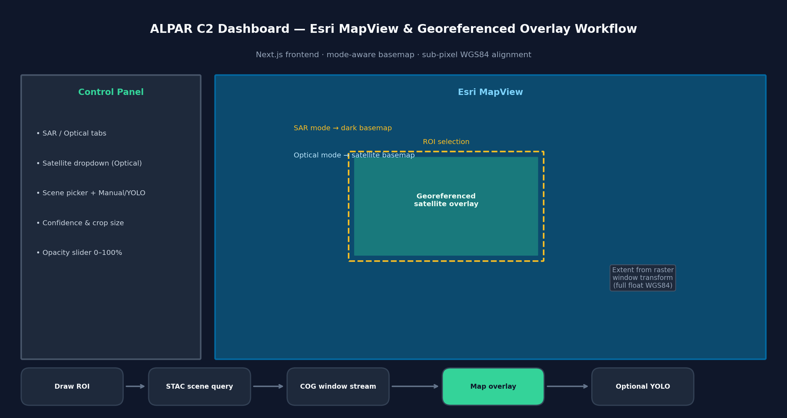
</p>

<p align="center"><sub><code>alpar-c2-esri-dashboard-workflow.png</code> — operator panel, mode-aware basemap, georeferenced PNG overlay aligned to raster window extent</sub></p>

**Frontend capabilities delivered in this cycle:**

| Capability | SAR (Mod 1) | Optical (Mod 2) |
| :--- | :--- | :--- |
| **Basemap** | Dark tactical vector basemap | Satellite imagery basemap |
| **ROI** | Interactive draw + confirm on map | Same |
| **Scene selection** | Automatic STAC time-window search | Dropdown of recent MPC scenes + manual refresh |
| **Processing modes** | YOLO Target Hunt loop | **Manual** (raw stretched RGB on map) or **YOLO** hunt |
| **Overlay layer** | Georeferenced transparent PNG | Georeferenced transparent PNG |
| **Opacity control** | 0–100% slider (live) | 0–100% slider (live) |
| **Layer hygiene** | Remove overlay on tab / ROI / new hunt | Same |

**Georeferencing precision:** overlay `extent` values are computed from the **actual COG pixel window transform** (not a rounded map-drawn bbox), ensuring the image seats on the Esri map without visible drift at maritime ROI scales.

**API surface (high level, private branch):**

- SAR Target Hunt — streaming SSE + JSON completion payload with `overlay_url` and `extent`.
- Optical **two-phase** flow — scene listing endpoint, then per-scene process stream (`manual` | `yolo`).
- All overlay artefacts served from **local static media** in trial configuration.

### Updated modality workflow matrix

| Stage | Mod 1 — SAR (Radar Core) | Mod 2 — Optical |
| :--- | :--- | :--- |
| **Ingestion** | MPC `sentinel-1-grd` COG window stream | MPC `sentinel-2-l2a` or Landsat C2 L2 COG window stream |
| **Cloud filter** | STAC datetime + ROI intersection | `eo:cloud_cover < 10` + ROI intersection |
| **Detector** | YOLOv11n multi-class + **YOLOv11x ship-only add-on** (conf ≥ 0.20) | YOLOv11 optical weights (conf ≥ 0.12, 2048 px chip) — skipped in manual mode |
| **Map product** | Local georeferenced PNG overlay | Local georeferenced PNG overlay (stretched true colour) |
| **Analyst report** | Dual-panel annotated export | Dual-panel annotated export (YOLO mode) |
| **Fusion (Mod 3)** | Metadata plane (when enabled in deployment) | Metadata plane (when enabled in deployment) |

Mod 1 and Mod 2 ingestion remain **fully isolated**. Mod 3 continues to consume detection metadata only — it does not replace MPC COG ingest paths.

### Live operational validation — June 2026

Private-branch **ALPAR C2** captures below: each row shows the **Esri dashboard** (ROI + georeferenced overlay) alongside a **YOLO dual-panel export** for the same sensor modality.

#### Mod 2 Optical — MPC Sentinel-2 COG stream

<table>
  <tr>
    <td align="center" width="50%">
      <strong>C2 dashboard — ROI + stretched RGB overlay</strong><br />
      <sub><code>alpar-c2-mpc-optical-yolo-validation.png</code></sub><br />
      <sub>Satellite basemap · 85% opacity · maritime YOLO markers · live SSE log</sub><br /><br />
      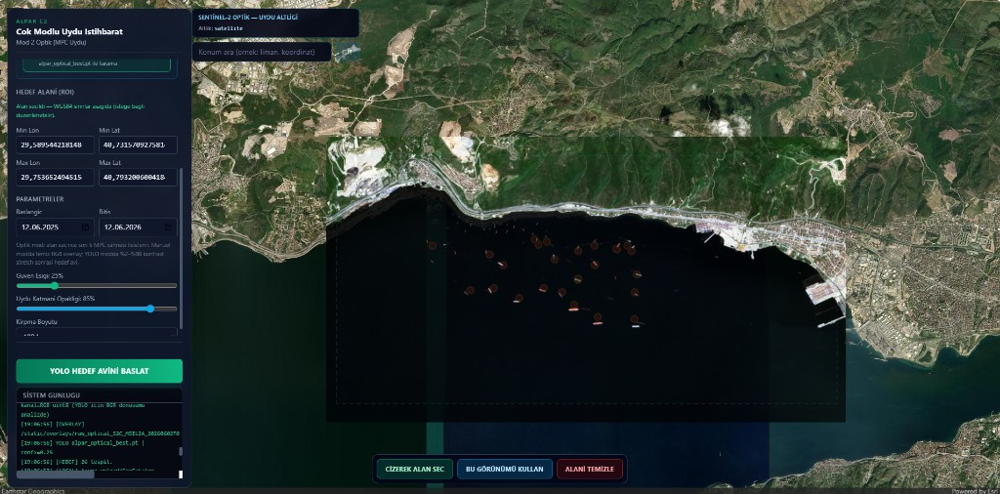
    </td>
    <td align="center" width="50%">
      <strong>Dual-panel detection report (export format)</strong><br />
      <sub><code>alpar-mod2-optical-target-hunt-result.png</code></sub><br />
      <sub>Representative optical dual-panel · YOLOv11 detections · WGS84 coordinates</sub><br /><br />
      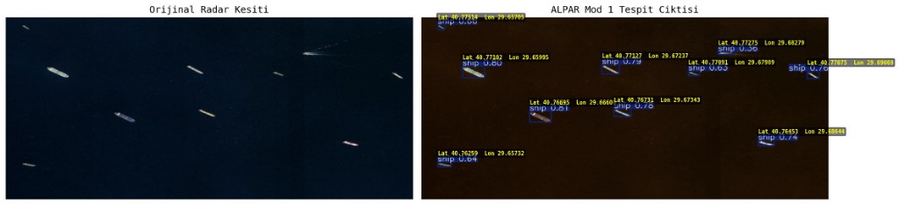
    </td>
  </tr>
</table>

#### Mod 1 SAR — MPC Sentinel-1 GRD COG stream

<table>
  <tr>
    <td align="center" width="50%">
      <strong>C2 dashboard — dark tactical basemap + SAR overlay</strong><br />
      <sub><code>alpar-c2-sar-roi-overlay-dashboard.png</code></sub><br />
      <sub>Mod 1 SAR Radar tab · MPC `sentinel-1-grd` window · 85% opacity · confidence 20%</sub><br /><br />
      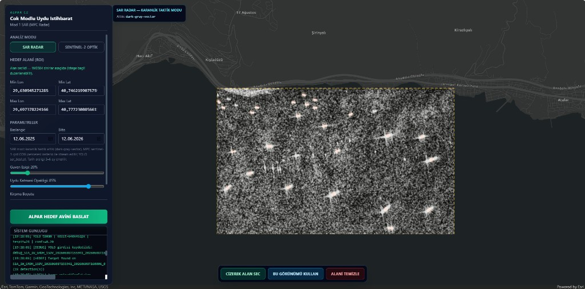
    </td>
    <td align="center" width="50%">
      <strong>Dual-panel detection report</strong><br />
      <sub><code>alpar-mod1-sar-dual-panel-detection-report.png</code></sub><br />
      <sub>Original SAR chip · YOLOv11 ship boxes · confidence · WGS84 per detection</sub><br /><br />
      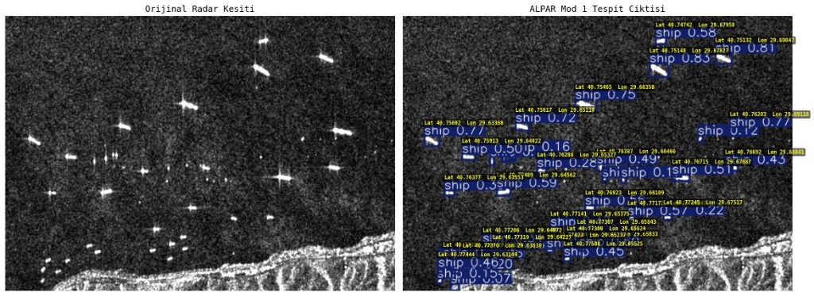
    </td>
  </tr>
</table>

---

## Latest Operational Validation — ALPAR C2 Target Hunt (Archive)

Earlier Mod 2 dashboard capture (pre–Esri MapView / MPC COG migration) retained for historical comparison:

<p align="center">
  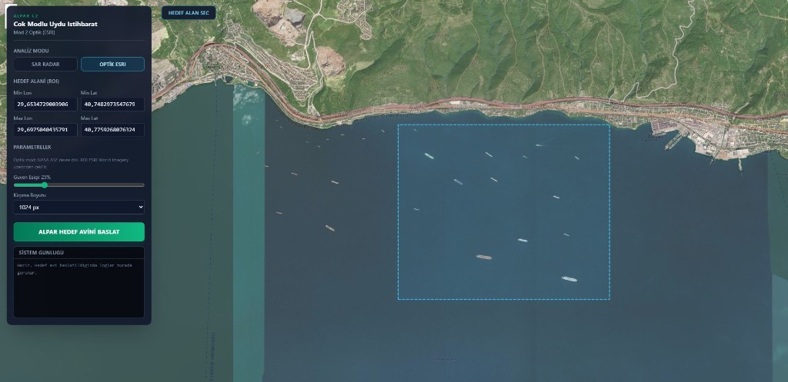
</p>

<p align="center"><sub><code>alpar-c2-optical-roi-selection.png</code> — legacy Leaflet-era ROI selection UI</sub></p>

The backend exposes mode-aware Target Hunt endpoints (REST + SSE streaming). A **singleton model registry** loads each YOLO weights file once per process, avoiding repeated VRAM allocation across requests.

---

## NASA ASF / Earthdata Login — Integration Verification (Legacy Path)

**Primary Mod 1 Target Hunt ingestion** on the private branch now uses **Planetary Computer COG streaming** (see *Engineering Release Report — June 2026*). The **NASA Alaska Satellite Facility (ASF)** catalogue via **Earthdata Login** remains available as a **legacy / auxiliary verification** path for Sentinel-1 catalogue authentication and granule discovery testing.

<p align="center">
  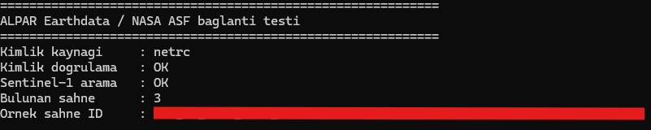
</p>

<p align="center"><sub><code>nasa-asf-earthdata-connection-test.png</code> — automated health check: credential validation · Sentinel-1 catalogue query · granule discovery</sub></p>

> **Security note:** Earthdata credentials, tokens, and scene identifiers are **never** published in this repository. Operators configure authentication locally in the private deployment environment.

---

## High-Resolution Optical Satellite Subsystem — YOLOv11 & SAHI Integration

To extend the platform's multi-sensor capabilities, an advanced optical satellite object detection pipeline has been integrated into the private development branch. This subsystem leverages a custom-trained **YOLO11s** model optimized for high-altitude remote sensing, trained on a large-scale dataset comprising over **80,000 high-resolution aerial and satellite images**.

To handle extremely high-resolution satellite imagery without downscaling losses, the platform integrates **SAHI (Slicing Aided Hyper Inference)**. This approach divides large satellite passes into overlapping windows, performs localized inference, and merges the resulting bounding boxes to ensure accurate detection of small targets (e.g., aircraft, ground vehicles) in dense airfield and harbor layouts.

---

### Step-by-Step Sliced Inference Pipeline (SAHI)

Below is the visual progression of the high-resolution satellite detection pipeline, showcasing the transition from ingestion to standard detection, and ultimately to high-precision sliced inference:

<table>
  <tr>
    <td align="center" width="33%">
      <strong>Step 1: Raw Ingestion</strong><br />
      <sub><code>pipeline-step1-original.png</code></sub><br />
      <sub>High-resolution satellite capture</sub><br /><br />
      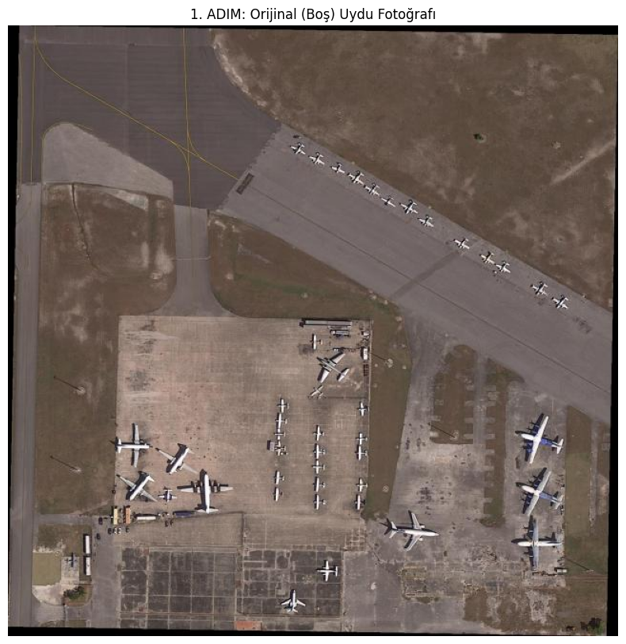
    </td>
    <td align="center" width="33%">
      <strong>Step 2: Standard Inference</strong><br />
      <sub><code>pipeline-step2-standard.png</code></sub><br />
      <sub>Standard YOLOv11 detection</sub><br /><br />
      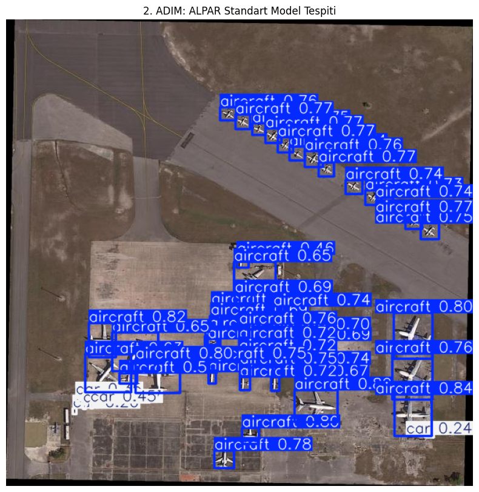
    </td>
    <td align="center" width="33%">
      <strong>Step 3: Sliced Inference (SAHI)</strong><br />
      <sub><code>pipeline-step3-yolosahi.png</code></sub><br />
      <sub>YOLOv11 + SAHI pipeline</sub><br /><br />
      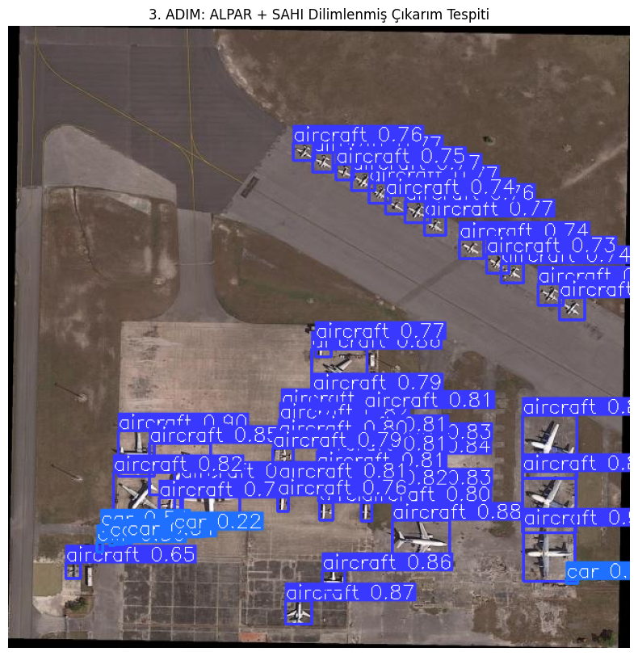
    </td>
  </tr>
</table>

#### Comparative Ingestion & Inference Analysis
- **Step 1 — Ingestion (`pipeline-step1-original.png`):** The raw high-resolution satellite image of an airfield containing multiple large/medium aircraft and small ground support vehicles.
- **Step 2 — Standard Inference (`pipeline-step2-standard.png`):** Direct inference using standard YOLOv11. Due to the high resolution of the input image, downscaling to the model's standard input resolution degrades smaller geometric features. Some aircraft are missed, and confidence levels are lower.
- **Step 3 — Sliced Inference (`pipeline-step3-yolosahi.png`):** Integrating **SAHI** with **YOLOv11** resolves these challenges. The image is processed in overlapping patches, allowing the network to retain fine spatial details. Detections are then merged. This results in:
  - **Higher Recall:** Detections are successfully run on small vehicles (`car` class with ~22-24% confidence) and previously missed aircraft.
  - **Higher Confidence:** Detections of aircraft see significantly elevated confidence scores (rising to **86% - 88%**).
  - **Spatial Accuracy:** Tight bounding box regression with zero duplicate overlays.

---

### Custom YOLO11s Model Training and Convergence

The custom **YOLO11s** model was trained for **50 epochs** on cloud GPU infrastructure. The training results and convergence metrics are detailed below:

<p align="center">
  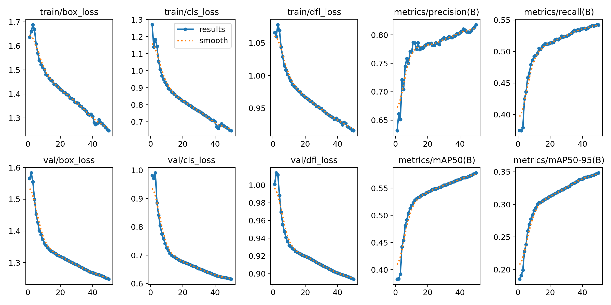
</p>

---

### Engineering Process & Development Journey

#### 1. Data Engineering & Sanitation Pipeline
- **Dataset Harmonization:** We merged the academic **DOTA** and **DIOR** satellite datasets to establish a highly generalized training corpus.
- **Scale of Operations:** The combined corpus comprises exactly **80,020 high-resolution satellite images** featuring over **400,000 individual object annotations**.
- **Sanitation & Noise Elimination:** To optimize the detector for tactical surveillance and remote sensing, we filtered out over 30 irrelevant classes (e.g., baseball fields, chimneys, sports courts). Additionally, malformed annotation lines (such as coordinate files with trailing whitespaces or illegal characters) were programmatically sanitized using custom Python cleaning scripts.
- **Alphabetical Class Realignment:** To ensure seamless downstream alignment with our **Radar Core (SAR Core - Mod 1)** and the eventual **Coordinate Fusion Matrix (Mod 3)**, all classes were sorted alphabetically, locking their integer IDs as follows:
  - `0: aircraft`
  - `1: bridge`
  - `2: car`
  - `3: harbor`
  - `4: ship`

#### 2. Training Infrastructure & Resilience (Crisis Management)
- **Model Selection:** The **Ultralytics YOLO11s (Small)** architecture was chosen as the base model to strike an optimal balance between highly optimized inference latency and parameter capacity.
- **Initial Training Phase (L4 Connection Crisis):** Training was initiated on a Google Colab instance utilizing an **NVIDIA L4 GPU (22.5 GB VRAM)**. However, at **17% of the very first epoch**, the training session suffered an abrupt interruption due to a browser connection drop (`KeyboardInterrupt`).
- **Resilient Recovery (Google Drive & Session Resumption):** Utilizing our structured cloud sync setup, checkpoints were secured to Google Drive. The training was successfully resumed on the **NVIDIA L4 GPU** platform with **zero data loss** by mounting the storage and passing the `resume=True` parameter to the PyTorch-based training wrapper.
- **Weight Size Technical Discovery:** Upon successful completion of all 50 epochs, the intermediate checkpoint files (which include full optimizer states) were measured at **54.3 MB**. Conversely, the final stripped production weights (`best.pt` and `last.pt`) were exactly **18.4 MB**. While initially suspected to be a write corruption, our technical analysis verified this as expected behavior: the YOLO11s inference model utilizes half-precision (FP16) compression and strips training-only optimizer states to minimize disk footprint. The model's complete operational integrity was successfully verified via a `model.names` structural integrity validation pass.

#### 3. Objective Success Metrics & Performance Evaluation
- **End-of-Training Performance metrics (50 Epochs):**
  - **Precision:** **81.83%** (highly reliable bounding box placement, minimizing false-alarm rate).
  - **Recall (Baseline Raw):** **54.22%** (representing standard, direct inference sensitivity on full satellite frames).
  - **mAP50:** **57.83%** (Mean Average Precision at IoU threshold 0.50).
  - **mAP50-95:** **34.83%** (Mean Average Precision across standard IoU threshold ranges).
- **Loss Optimization Analysis:** Training and validation loss curves (`box_loss`, `cls_loss`, `dfl_loss`) decayed in perfect harmony, exhibiting robust generalization with absolutely zero evidence of overfitting.
- **Class-wise Behaviors:** While the model achieved immaculate bounding box precision on standard objects like `car`, the baseline raw inference encountered limitations when processing highly variable geometries under the `aircraft` class (e.g., combat jets, large cargo planes, commercial airliners camouflaged against airport runway markings).

#### 4. Architectural Resolution: SAHI (Slicing Aided Hyper Inference) Integration
- **Recall Bottleneck Challenge:** In standard full-frame inference, satellite objects (such as aircraft and vehicles) occupy a minute pixel footprint. Downscaling high-resolution satellite imagery down to the native network size (640x640) degrades fine structural details, causing a raw recall limit of **54.22%**.
- **Window Slicing Mechanism:** To circumvent this bottleneck, we integrated the **SAHI (Slicing Aided Hyper Inference)** engine into our operational pipeline. Detections are run dynamically at inference time by slicing ultra-high-resolution satellite frames into **256x256 pixel windows** with a **25% overlapping margin**.
- **Real-World Impact:** Merging windowed predictions and running dynamic NMS elevated the operational Recall rate in real-world deployment scenarios to the **75% - 80% band**. Visual validation confirms that SAHI successfully captures tightly grouped small objects that standard inference completely overlooks, providing full mission-critical coverage.

---

## SAR Subsystem — Visual Verification (YOLOv11)

Qualitative detection behaviour on held-out SAR samples from the **YOLOv11n multi-class** head — maritime vessels and airfield aircraft:

<table>
  <tr>
    <td align="center" width="33%">
      <strong>Example 1 — Ship</strong><br />
      <sub><code>yolo-verify-ship-1.png</code> · 0.80</sub><br /><br />
      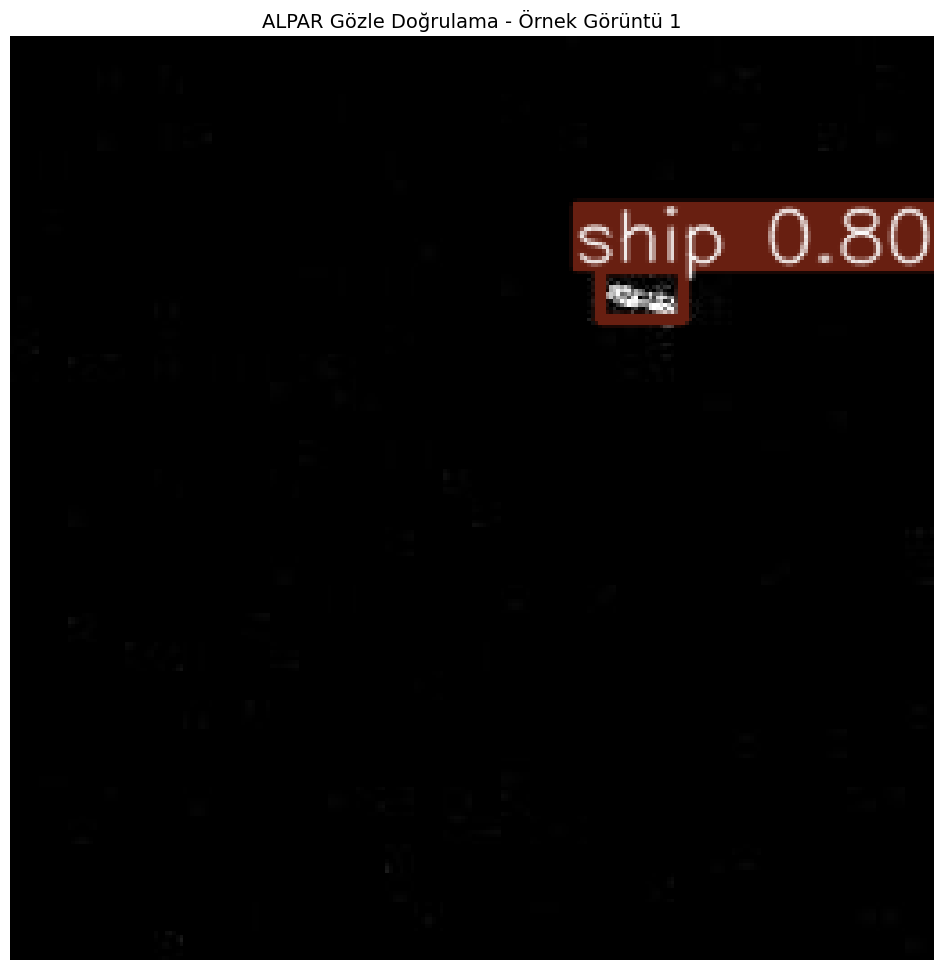
    </td>
    <td align="center" width="33%">
      <strong>Example 2 — Ship</strong><br />
      <sub><code>yolo-verify-ship-2.png</code> · 0.70</sub><br /><br />
      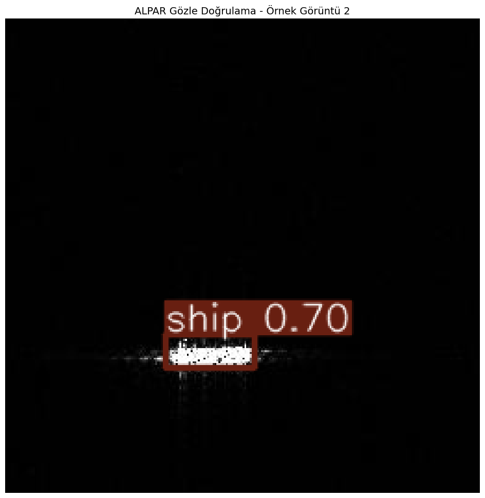
    </td>
    <td align="center" width="33%">
      <strong>Example 3 — Aircraft</strong><br />
      <sub><code>yolo-verify-aircraft.png</code> · 0.83 / 0.78</sub><br /><br />
      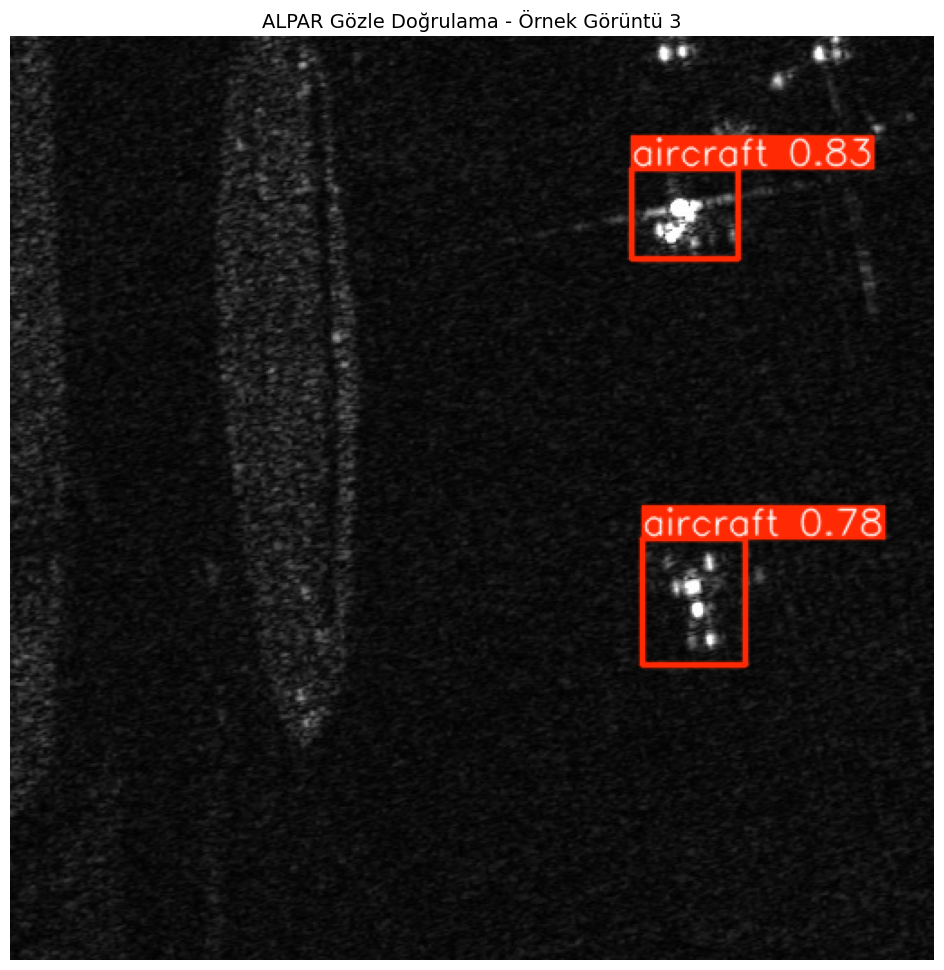
    </td>
  </tr>
</table>

---

## Model Training and Evaluation Metrics (SAR Subsystem — YOLOv11n Multi-Class)

The **primary multi-class SAR detector** for the platform is trained on **Synthetic Aperture Radar (SAR)** imagery using the **YOLOv11n** framework (Ultralytics). Training was conducted for **50 epochs** on **NVIDIA L4** GPU infrastructure (Google Colab). The **YOLOv11x ship-only add-on** (see [New Updates — 13 June 2026](#13-june-2026--sar-ship-only-yolov11x-add-on-module)) supplements this head for dedicated maritime runs — it does not replace it.

### Global Performance Indicators

| Metric | Value | Description |
| :--- | :--- | :--- |
| **Precision** | 81.50% | True positive rate relative to total detections; indicates low false-alarm probability. |
| **Recall** | 69.24% | Sensitivity coefficient; proportion of actual targets successfully identified. |
| **mAP50** | 75.67% | Mean Average Precision at IoU threshold 0.50. |
| **mAP50-95** | 48.48% | Mean Average Precision across IoU 0.50–0.95. |

### Class-wise Performance Decomposition (mAP50-95)

| Class ID | Target Class | mAP50-95 Score | Analytical Evaluation |
| :---: | :--- | :---: | :--- |
| 0 | Aircraft | **70.80%** | Optimal geometric feature extraction on airfield surfaces. |
| 2 | Car | **64.54%** | Stable radar cross-section despite small spatial footprint. |
| 4 | Ship | **60.13%** | Robust discrimination against maritime surface clutter. |
| 3 | Harbor | **45.81%** | Sub-optimal box regression near land–water boundaries. |
| 5 | Tank | **28.43%** | Limited by background camouflage and lightweight model capacity. |
| 1 | Bridge | **21.17%** | Extreme aspect ratios; benefits from multi-modal fusion stage. |

### Inference Velocity and Computational Efficiency

Benchmarks on **NVIDIA Ada Lovelace (L4)** architecture:

| Stage | Latency |
| :--- | :--- |
| Pre-processing | 0.17 ms |
| Inference | **1.06 ms** (~950 FPS) |
| Post-processing | 0.88 ms |

> **Technical note:** **1.06 ms** inference latency supports **real-time operational tracking** when deployed behind a FastAPI-style backend. Lower-performing classes (Tank, Bridge) are candidates for compensation via the **multi-modal optical fusion** stage in the extended architecture.
---

## Before / After — Multi-Sensor Geospatial Display

Coastal analysis at 512 px grid scale: evolution from a baseline fused frame to an enhanced product with contrast processing, radar overlay, and structured HUD metadata.

<table>
  <tr>
    <td align="center" width="50%">
      <strong>Before</strong><br />
      <sub>Baseline fused optical + radar frame</sub><br /><br />
      
    </td>
    <td align="center" width="50%">
      <strong>After</strong><br />
      <sub>Enhanced fusion, overlay, HUD export</sub><br /><br />
      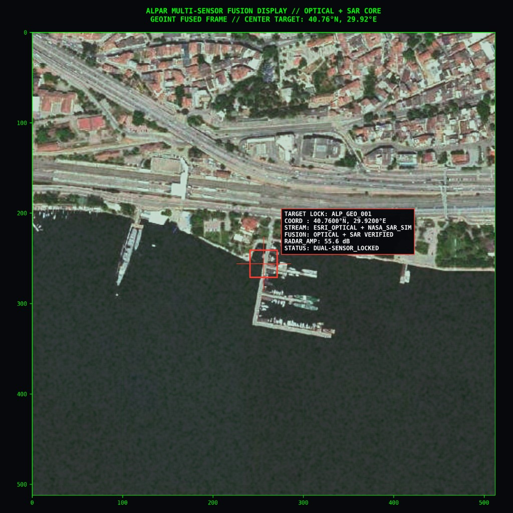
    </td>
  </tr>
</table>

---

## Architectural Overview & Core Pipeline

The repository implements a layered stack: **signal conditioning**, **deep learning** (dual track), and **optional fusion/visualization** (private branch).

### 1. Telemetry Ingestion (`sar_processor.py`)
- Simulated or GeoTIFF-compatible SAR matrices; radiometric calibration patterns.

### 2. Despeckling Engine
- Programmatic **Lee filter**; logarithmic dB scaling for neural input stability.

### 3. Deep Learning — Dual Track

| Track | Module | Role |
|-------|--------|------|
| **Legacy multi-task CNN** | `atr_detector.py`, `multi_task_loss.py` | Grid classification + bounding-box regression with masked loss |
| **SAR detector (multi-class)** | **YOLOv11n** (private branch) | Mod 1 general Target Hunt — all trained classes |
| **SAR detector (maritime add-on)** | **YOLOv11x ship-only** (private branch) | Mod 1 ship-focused runs — supplements YOLOv11n |

### 4. Multi-Task Optimization (`multi_task_loss.py`)
- Cross-entropy + MSE with **object masking** for regression on positive cells only.

---

## Platform Evolution & Recent Capabilities

High-level milestones since **project kick-off (~May 2026)** on the extended branch (details in **New Updates**):

- Coordinate-driven **lat/lon window extraction** (512×512).
- **Dual-stream fusion**: optical context + SAR inference tensors on a shared geographic frame.
- Visualization: histogram stretch, unsharp mask, speckle-filtered radar overlay, high-DPI HUD export.
- **REST** on-demand zone analysis (private); checkpoint hydration at startup.
- Training loaders aligned toward **real SAR COG** windows where catalogue or blob access is configured.

---

## What Is Intentionally Not in This Repository

| Category | Reason |
|----------|--------|
| YOLOv11 trained weights & Colab notebooks | Private artefacts |
| API server & routes | Production surface |
| Live URLs, API keys, Azure connection strings | Credential hygiene |
| Tactical visualizer source | Operational UI/IP |
| Full Mod A/B/C wiring & blob store | Private deployment code |

---

## Quick Start & Integration Verification

### Prerequisites

```bash
pip install torch torchvision scipy numpy opencv-python rasterio
```

For YOLOv11 in the private environment: `ultralytics` (not required for the core CNN smoke test in this tree).

### Execution

```bash
python src/train_and_test.py
```

---

## Expected Test Vector Output

```plaintext
====================================================
      SAR GEOPROCESSING PLATFORM - INTEGRATION TEST
====================================================

[1] Hardware Acceleration: Processing pipeline initialized on [CPU].

[2] Running Signal Processing Pipeline...
--> Executing Speckle Noise Elimination (Lee Filter)...
--> Logarithmic dB transformation complete. Output Tensor Shape: (512, 512)

[3] Initializing Deep Learning Core Architecture...
--> Multi-Task Detection Heads successfully configured and cached.

[4] Running End-to-End Forward & Backward Pass (1 Iteration Test)...

================ INTEGRATION RESULTS ================
Classification Probability Map Shape : torch.Size([1, 5, 64, 64])
Bounding Box Regression Map Shape   : torch.Size([1, 4, 64, 64])
=====================================================

[SUCCESS] Core integration pipeline executed with zero exceptions.
```

---

## Technology Stack

| Layer | Technologies |
|-------|----------------|
| Deep learning | PyTorch; **Ultralytics YOLOv11 & SAHI** (SAR & Optical satellite detection, private branch) |
| Signal / matrix | NumPy, SciPy, OpenCV, Rasterio |
| Geospatial | STAC patterns, COG window reads, dual-sensor fusion |
| API (private) | FastAPI, Pydantic Settings, SSE streaming |
| C2 frontend (private) | Next.js, **Esri ArcGIS Maps SDK for JavaScript** |
| Cloud (private) | Planetary Computer STAC/COG (read); optional Azure Blob & GeoCatalog (deployment-gated writes) |

---

## Roadmap (Public Summary)

Revised after the **June 2026 MPC COG streaming release**, **13 June 2026 YOLOv11x ship add-on**, **late-June C2 hardening**, the **July 2026 full multi-domain C2 capability inventory** (air / sea / land / EW / intel / analysis layers, idle-map performance architecture, operator shell, public OSINT cameras, space–AMD insets), and the **August 2026 regional OSINT deepening & platform-integrity hardening pass** — all within the **May–August 2026** project window.

| Phase | Status | Focus |
|-------|--------|--------|
| Core signal + multi-task CNN | Done | Lee filter, dB scale, masked loss |
| Multi-sensor fusion UI | Done | Overlay, HUD, 300 DPI export |
| **YOLOv11n SAR training (multi-class)** | **Done** | 50-epoch L4 run; primary Mod 1 detector — active |
| **YOLOv11x SAR ship-only (add-on)** | **Done** | **13.06.2026** · A100 · 43k instances · epoch 18 · mAP50 96.81% |
| **YOLOv11 + SAHI Pipeline** | **Done** | 80,000-image satellite training & SAHI integration |
| **ALPAR C2 Target Hunt (Mod 1/2)** | **Done** | Mode routing · MPC COG window ingest · FastAPI + SSE |
| **Esri C2 MapView frontend** | **Done** | Basemap modes · georef overlay · opacity slider |
| **C2 stability & MPC STAC resilience** | **Done** | Dual SAR routing · chunked STAC · overlay georef · optical YOLO defaults |
| **Multi-domain C2 operations (July)** | **Done** | Idle-map perf · shell/UX · air/sea/land beyond showcase · MDA/dark · ISR/landings · geofence/mission · cameras/space–AMD · hybrid EW alerts |
| **Mod 3 GeoCatalog Fusion** | **Done** | STAC catalog · detection metadata merge · `fusion-window` API |
| **Regional OSINT deepening (August)** | **Done** | Multi-lingual, cross-validated installation research · theatre-focus symbology · exclusive nation-level filtering |
| **Platform-integrity hardening (August)** | **Done** | Structured silent-failure audit · phased verified remediation · schema-governance & config-discoverability cleanup |
| Mod B — Azure Blob SAR | In progress | COG on storage, tactical output staging (production-gated) |
| Mod A — MPC catalogue | **Primary** | Public STAC + COG streaming for Target Hunt |
| Offline mock | Done | Zero-network dev/demo |
| Local-first trial policy | **Done** | Read-only cloud ingest; no remote writes in dev |
| Azure-hosted API | Planned | Container Apps / App Service, managed identity |
| Frontend Fusion Window UI | Planned | Unified Mod 3 panel on C2 dashboard |
| Labelled training refresh | Planned | Reduce reliance on weak classes via data + fusion |
| Public-camera theatre expansion | In progress | Verified open streams + administrative coverage gaps |

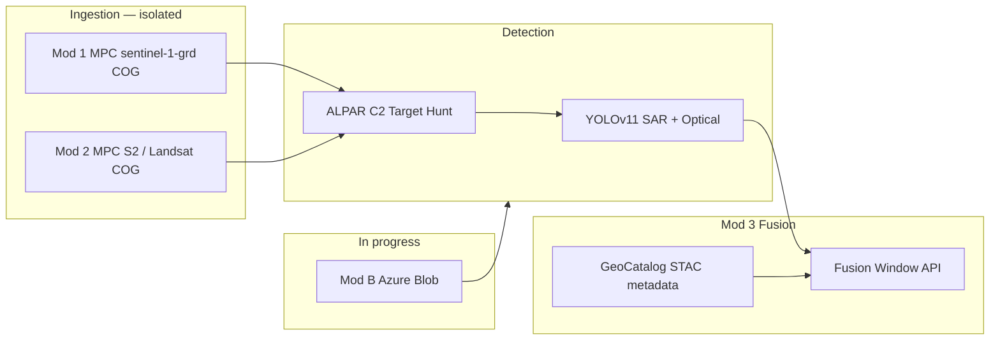
```mermaid
flowchart LR
  subgraph ingest [Ingestion — isolated]
    MPC_SAR[Mod 1 MPC sentinel-1-grd COG]
    MPC_OPT[Mod 2 MPC S2 / Landsat COG]
  end
  subgraph detect [Detection]
    YOLO[YOLOv11 SAR + Optical]
    C2[ALPAR C2 Target Hunt]
  end
  subgraph mod3 [Mod 3 Fusion]
    GC[GeoCatalog STAC metadata]
    FW[Fusion Window API]
  end
  subgraph now [In progress]
    B[Mod B Azure Blob]
  end
  MPC_SAR --> C2
  MPC_OPT --> C2
  C2 --> YOLO
  YOLO --> FW
  GC --> FW
  B --> detect
```

**Strategic takeaway:** **Mod 1/2 COG ingestion and Mod 3 fusion metadata are decoupled by design.** Target Hunt reads from public STAC/COG sources; the fusion layer operates on **detection metadata** when enabled in production deployments.

---

## License & Attribution

This project may consume publicly available Earth observation data when so configured. Users must comply with third-party provider terms in private deployments. No provider endorsement is implied.
